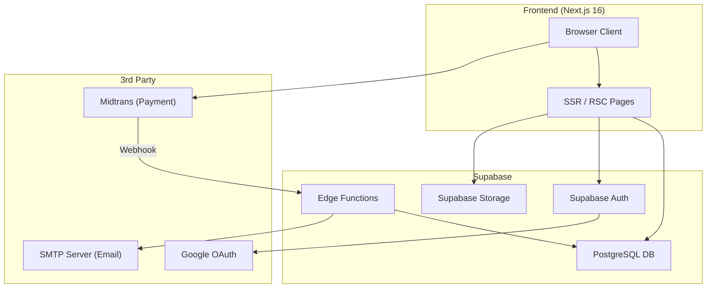
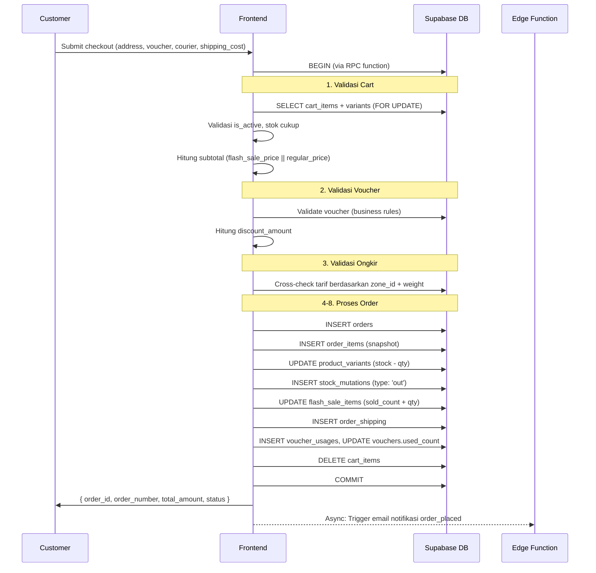
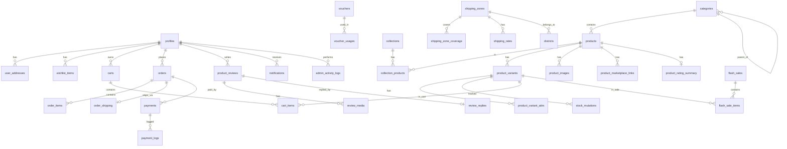

# 📋 PRD — Benangbaju E-Commerce Platform

> **Product Name:** Benangbaju Store
> **Tagline:** *Fashion Muslim Premium Indonesia*
> **Version:** 1.0.0
> **Date:** 9 Juni 2026

---

## Daftar Isi

1. [Ringkasan Eksekutif](#1-ringkasan-eksekutif)
2. [Tech Stack & Arsitektur](#2-tech-stack--arsitektur)
3. [Domain 1 — User & Autentikasi](#3-domain-1--user--autentikasi)
4. [Domain 2 — Katalog & Produk](#4-domain-2--katalog--produk)
5. [Domain 3 — Inventori & Stok](#5-domain-3--inventori--stok)
6. [Domain 4 — Cart & Wishlist](#6-domain-4--cart--wishlist)
7. [Domain 5 — Promosi (Voucher & Flash Sale)](#7-domain-5--promosi-voucher--flash-sale)
8. [Domain 6 — Order & Checkout](#8-domain-6--order--checkout)
9. [Domain 7 — Payment (Midtrans)](#9-domain-7--payment-midtrans)
10. [Domain 8 — Shipping (Custom)](#10-domain-8--shipping-custom)
11. [Domain 9 — Review & Rating](#11-domain-9--review--rating)
12. [Domain 10 — Admin Panel & CMS](#12-domain-10--admin-panel--cms)
13. [Domain 11 — Notifikasi & Email](#13-domain-11--notifikasi--email)
14. [Domain 12 — Return & Refund](#14-domain-12--return--refund)
15. [Non-Functional Requirements](#15-non-functional-requirements)
16. [Acceptance Criteria & Definition of Done](#16-acceptance-criteria--definition-of-done)
17. [Success Metrics / KPIs](#17-success-metrics--kpis)
18. [Out of Scope (v1.0)](#18-out-of-scope-v10)
19. [Search Experience](#19-search-experience)
20. [Related Products & Recently Viewed](#20-related-products--recently-viewed)
21. [Back-in-Stock Notification](#21-back-in-stock-notification)
22. [Invoice PDF](#22-invoice-pdf)
23. [Contact Form](#23-contact-form)
24. [Skema Database Lengkap](#24-skema-database-lengkap)
25. [API / RPC Map](#25-api--rpc-map)
26. [Frontend Page Map](#26-frontend-page-map)
27. [Environment Variables](#27-environment-variables)
28. [Error Handling & Edge Cases](#28-error-handling--edge-cases)
29. [Rate Limiting](#29-rate-limiting)
30. [Testing Strategy](#30-testing-strategy)
31. [Error Monitoring](#31-error-monitoring)
32. [Aksesibilitas (a11y)](#32-aksesibilitas-a11y)
33. [Roadmap Post-MVP](#33-roadmap-post-mvp)
34. [Glossary](#34-glossary)

---

## 1. Ringkasan Eksekutif

### 1.1 Deskripsi Produk
**Benangbaju** adalah platform e-commerce **fashion muslim premium** berbasis web yang menyediakan pengalaman belanja end-to-end: mulai dari browsing produk, keranjang belanja, checkout dengan berbagai metode pembayaran, pengiriman dengan tarif custom, hingga ulasan & rating produk.

### 1.2 Target Pengguna

| Persona | Deskripsi |
|---------|-----------|
| **Customer (Pembeli)** | Wanita muslim Indonesia yang mencari hijab, gamis, mukena, dan busana muslim premium |
| **Admin (Pengelola Toko)** | Tim operasional toko yang mengelola produk, pesanan, promosi, dan konten |

### 1.3 Tujuan Bisnis
- Menyediakan toko online fashion muslim yang modern dan terpercaya
- Mendukung multi-channel payment melalui Midtrans (bank transfer, e-wallet, QRIS)
- Pengiriman dengan sistem tarif custom berbasis zona & berat
- Dashboard admin lengkap untuk operasional harian toko
- Tampilan harga perbandingan dari marketplace lain (Shopee, TikTok Shop, dll)

---

## 2. Tech Stack & Arsitektur

### 2.1 Backend-as-a-Service: Supabase
| Komponen | Teknologi | Detail |
|----------|-----------|--------|
| Database | PostgreSQL (Supabase) | Via Supabase hosted PostgreSQL |
| Auth | Supabase Auth | Email+Password, Google OAuth 2.0 |
| File Storage | Supabase Storage | Bucket per kategori file |
| Serverless Functions | Supabase Edge Functions (Deno) | Midtrans webhook, email notifikasi |
| Row Level Security | Supabase RLS | Policy per tabel per role |
| Realtime | — | Tidak digunakan (MVP) |

### 2.2 Frontend
| Komponen | Teknologi | Detail |
|----------|-----------|--------|
| Framework | Next.js 16.2 (App Router) | TypeScript, React 19 |
| Styling | Tailwind CSS v4 | PostCSS pipeline |
| State Management | Zustand v5 | Persistent stores (localStorage) |
| Data Fetching | TanStack React Query v5 | Server state management |
| Supabase Client | @supabase/supabase-js v2 | Auth, DB queries, Storage |
| Forms | React Hook Form + Zod v4 | Form validation |
| Animations | Framer Motion v12 | Page transitions, micro-animations |
| Icons | Lucide React | Consistent icon system |
| Notifications | react-hot-toast | Toast notifications |
| Payment | Midtrans Snap.js | Client-side payment popup |

### 2.3 Infrastructure
| Komponen | Teknologi |
|----------|-----------|
| Hosting Frontend | Vercel / cPanel (Next.js) |
| Backend | Supabase Cloud (hosted) |
| File Storage | Supabase Storage (S3-compatible) |
| Email | Nodemailer (SMTP) via Edge Function |
| PDF Invoice | Supabase Edge Function (generasi PDF sederhana) |

### 2.4 Arsitektur Diagram



### 2.5 Perbedaan Utama dari Ansania

| Aspek | Ansania | Benangbaju |
|-------|---------|------------|
| Backend | Express.js (Node.js) | Supabase (BaaS) |
| Database | MySQL 8.0 | PostgreSQL (Supabase) |
| Auth | JWT custom + Passport.js | Supabase Auth |
| File Upload | Multer (local disk) | Supabase Storage |
| Cache | Redis 7 | Tidak ada (query langsung) |
| Background Jobs | BullMQ + Worker process | Tidak ada (lazy eval + manual) |
| Shipping | Biteship API | Custom DB (zona + tarif/kg) |
| ERP | Jubelio | Tidak ada |
| CORS | Dikonfigurasi manual | Supabase RLS + policy |
| Brand | Multi-brand | Single brand (benangbaju) |
| Struktur Katalog | Category + Brand | Category + Collection |

---

## 3. Domain 1 — User & Autentikasi

### 3.1 Data Model

#### Tabel: `profiles`
> Extend dari `auth.users` milik Supabase Auth. Dibuat via trigger `on_auth_user_created`.

| Kolom | Tipe | Constraint | Deskripsi |
|-------|------|------------|-----------|
| `id` | UUID | PK, FK → auth.users (CASCADE) | ID unik user (sama dengan Supabase Auth) |
| `name` | VARCHAR(100) | NOT NULL | Nama lengkap |
| `phone` | VARCHAR(20) | NULL | Nomor telepon |
| `avatar_url` | VARCHAR(500) | NULL | URL foto profil (Supabase Storage) |
| `role` | TEXT | DEFAULT 'customer' | 'customer' atau 'admin' |
| `is_active` | BOOLEAN | DEFAULT true | Status aktif akun |
| `created_at` | TIMESTAMPTZ | DEFAULT now() | Waktu registrasi |
| `updated_at` | TIMESTAMPTZ | ON UPDATE | Auto-update |

**RLS Policy:**
- `SELECT`: User hanya bisa baca profil sendiri. Admin bisa baca semua.
- `UPDATE`: User hanya bisa update profil sendiri.

#### Tabel: `user_addresses`
| Kolom | Tipe | Deskripsi |
|-------|------|-----------|
| `id` | UUID | PK |
| `user_id` | UUID | FK → profiles (CASCADE) |
| `label` | VARCHAR(50) | Contoh: "Rumah", "Kantor" |
| `recipient_name` | VARCHAR(100) | Nama penerima |
| `phone` | VARCHAR(20) | Nomor telepon penerima |
| `province_name` | VARCHAR(100) | Nama provinsi |
| `city_name` | VARCHAR(100) | Nama kota/kabupaten |
| `district_name` | VARCHAR(100) | Nama kecamatan |
| `postal_code` | VARCHAR(10) | Kode pos |
| `full_address` | TEXT | Alamat lengkap (jalan, RT/RW, dll) |
| `zone_id` | UUID | FK → shipping_zones (untuk kalkulasi ongkir) |
| `is_default` | BOOLEAN | DEFAULT false |
| `created_at` | TIMESTAMPTZ | DEFAULT now() |

### 3.2 Fitur Autentikasi

#### FR-AUTH-01: Registrasi (Email + Password)
- **Input:** name, email, password
- **Proses:**
  1. Panggil `supabase.auth.signUp({ email, password })`
  2. Supabase otomatis kirim email verifikasi
  3. Trigger PostgreSQL `on_auth_user_created` → insert ke tabel `profiles`
- **Response:** Session (access_token + refresh_token) dari Supabase Auth
- **Side effects (frontend):** Sync wishlist dari DB, merge guest cart

#### FR-AUTH-02: Login (Email + Password)
- **Input:** email, password
- **Proses:** `supabase.auth.signInWithPassword({ email, password })`
- **Response:** Session dari Supabase Auth
- **Guard:** Akun harus aktif (`profiles.is_active = true`) — dicek via RLS atau middleware frontend

#### FR-AUTH-03: Login OAuth (Google)
- **Proses:**
  1. `supabase.auth.signInWithOAuth({ provider: 'google' })`
  2. Redirect ke Google consent screen
  3. Callback → Supabase handle token, trigger `on_auth_user_created` jika user baru
- **Auto-create:** Profile baru dari OAuth otomatis `email_verified_at` terisi

#### FR-AUTH-04: Logout
- **Proses:** `supabase.auth.signOut()` → clear session lokal + cookies

#### FR-AUTH-05: Forgot Password
- **Proses:** `supabase.auth.resetPasswordForEmail(email)` → Supabase kirim email reset
- **Security:** Supabase tidak membedakan apakah email terdaftar atau tidak (anti-enumeration)

#### FR-AUTH-06: Reset Password
- **Proses:** User klik link dari email → `supabase.auth.updateUser({ password: newPassword })`

#### FR-AUTH-07: Verifikasi Email
- Ditangani sepenuhnya oleh Supabase Auth (magic link bawaan verifikasi)

### 3.3 Fitur User Profile

#### FR-USER-01: Lihat Profil
- **Query:** `SELECT * FROM profiles WHERE id = auth.uid()`
- **Response:** id, name, phone, avatar_url, role, is_active, created_at

#### FR-USER-02: Update Profil
- **Updatable fields:** name, phone
- **Upload avatar:** Upload ke Supabase Storage bucket `avatars/{user_id}/avatar.{ext}` → simpan URL ke `profiles.avatar_url`

#### FR-USER-03: Ganti Password
- **Proses:** `supabase.auth.updateUser({ password: newPassword })`
- **Guard:** User harus sudah login (session aktif)

#### FR-USER-04: Hapus Akun (Soft Delete)
- **Proses:**
  1. Update `profiles`: name → "Deleted User", phone → NULL, avatar_url → NULL, is_active → false
  2. Update email di `auth.users` via admin API (Edge Function)
  3. `supabase.auth.signOut()`

### 3.4 Manajemen Alamat

#### FR-ADDR-01: Tambah Alamat
- **Fields:** label, recipient_name, phone, province_name, city_name, district_name, postal_code, full_address, zone_id, is_default
- **Business Rule:** Jika `is_default = true`, set semua alamat lain user tersebut `is_default = false` (via trigger DB atau logic aplikasi)

#### FR-ADDR-02: Update / Hapus Alamat
- **RLS:** Hanya pemilik alamat yang bisa edit/hapus

#### FR-ADDR-03: Set Alamat Default
- Reset semua alamat user → set alamat yang dipilih sebagai default

### 3.5 Frontend State (Auth Store)
- **Library:** Zustand + persist middleware
- **Persistence:** `benangbaju-auth` key di localStorage
- **Session management:** Supabase Auth handle session + auto-refresh token via `onAuthStateChange`
- **Side effects on login/register/OAuth:**
  1. Sync wishlist dari DB
  2. Merge guest cart → user cart
  3. Sync cart dari DB

---

## 4. Domain 2 — Katalog & Produk

### 4.1 Data Model

#### Tabel: `categories`
| Kolom | Tipe | Deskripsi |
|-------|------|-----------|
| `id` | UUID | PK |
| `parent_id` | UUID | FK → categories (self-referencing, nullable) |
| `name` | VARCHAR(150) | Nama kategori |
| `slug` | VARCHAR(180) | URL slug (UNIQUE) |
| `description` | TEXT | Deskripsi (nullable) |
| `image_url` | VARCHAR(500) | Gambar kategori (Supabase Storage) |
| `sort_order` | INT | DEFAULT 0 |
| `is_active` | BOOLEAN | DEFAULT true |

#### Tabel: `collections`
> Kurasi editorial/tematik produk. Contoh: "Ramadan 2025", "New Arrivals", "Best Seller", "Edisi Lebaran"

| Kolom | Tipe | Deskripsi |
|-------|------|-----------|
| `id` | UUID | PK |
| `name` | VARCHAR(150) | Nama koleksi |
| `slug` | VARCHAR(180) | URL slug (UNIQUE) |
| `description` | TEXT | Deskripsi (nullable) |
| `image_url` | VARCHAR(500) | Banner koleksi (Supabase Storage) |
| `sort_order` | INT | DEFAULT 0 |
| `is_active` | BOOLEAN | DEFAULT true |
| `starts_at` | TIMESTAMPTZ | Tanggal mulai tampil (nullable) |
| `ends_at` | TIMESTAMPTZ | Tanggal selesai tampil (nullable) |

#### Tabel: `collection_products`
> Many-to-many: koleksi ↔ produk

| Kolom | Tipe | Deskripsi |
|-------|------|-----------|
| `collection_id` | UUID | FK → collections (CASCADE) |
| `product_id` | UUID | FK → products (CASCADE) |
| `sort_order` | INT | Urutan produk dalam koleksi |
| UNIQUE | | `(collection_id, product_id)` |

#### Tabel: `products`
| Kolom | Tipe | Deskripsi |
|-------|------|-----------|
| `id` | UUID | PK |
| `category_id` | UUID | FK → categories |
| `name` | VARCHAR(255) | Nama produk |
| `slug` | VARCHAR(280) | URL slug (UNIQUE) |
| `description` | TEXT | Deskripsi lengkap |
| `short_description` | TEXT | Deskripsi singkat |
| `weight_gram` | INT | Berat default (gram) |
| `is_active` | BOOLEAN | DEFAULT true |
| `is_featured` | BOOLEAN | DEFAULT false |
| `meta_title` | VARCHAR(255) | SEO title |
| `meta_description` | TEXT | SEO description |
| `created_at` | TIMESTAMPTZ | DEFAULT now() |
| `updated_at` | TIMESTAMPTZ | AUTO |

> **Catatan:** Kolom `tsvector` untuk full-text search PostgreSQL dapat ditambahkan via generated column atau trigger.

#### Tabel: `product_variants`
| Kolom | Tipe | Deskripsi |
|-------|------|-----------|
| `id` | UUID | PK |
| `product_id` | UUID | FK → products (CASCADE) |
| `sku` | VARCHAR(100) | Stock Keeping Unit (UNIQUE) |
| `name` | VARCHAR(255) | Nama variant (contoh: "Merah - XL") |
| `price` | NUMERIC(15,2) | Harga jual |
| `compare_price` | NUMERIC(15,2) | Harga coret (nullable) |
| `stock` | INT | Stok tersedia (DEFAULT 0) |
| `weight_gram` | INT | Berat variant (nullable, fallback ke produk) |
| `is_active` | BOOLEAN | DEFAULT true |

#### Tabel: `product_variant_attrs`
| Kolom | Tipe | Deskripsi |
|-------|------|-----------|
| `id` | UUID | PK |
| `variant_id` | UUID | FK → product_variants (CASCADE) |
| `attr_name` | VARCHAR(50) | Contoh: "Warna", "Ukuran" |
| `attr_value` | VARCHAR(100) | Contoh: "Merah", "XL" |

#### Tabel: `product_images`
| Kolom | Tipe | Deskripsi |
|-------|------|-----------|
| `id` | UUID | PK |
| `product_id` | UUID | FK → products (CASCADE) |
| `variant_id` | UUID | FK → product_variants (nullable) |
| `url` | VARCHAR(500) | URL Supabase Storage |
| `alt_text` | VARCHAR(255) | Alt text |
| `sort_order` | INT | DEFAULT 0 |
| `is_primary` | BOOLEAN | DEFAULT false |

#### Tabel: `product_marketplace_links`
> Link perbandingan harga ke marketplace lain (Shopee, TikTok Shop, dll)

| Kolom | Tipe | Deskripsi |
|-------|------|-----------|
| `id` | UUID | PK |
| `product_id` | UUID | FK → products (CASCADE) |
| `platform` | VARCHAR(50) | 'shopee', 'tiktok', 'tokopedia', 'lazada', dll |
| `url` | TEXT | URL produk di marketplace |
| `label` | VARCHAR(100) | Label tampil (opsional, contoh: "Cek di Shopee") |
| `sort_order` | INT | DEFAULT 0 |

### 4.2 Fitur Produk

#### FR-PROD-01: Listing Produk (Public)
- **Query:** Supabase JS client dengan filter, sorting, pagination
- **Filter:** `category_id`, `collection_id` (join via `collection_products`), `is_featured`, `q` (full-text search PostgreSQL)
- **Sorting:** price_asc, price_desc, newest (created_at DESC)
- **Pagination:** range-based (`.range(from, to)`)
- **Response per item:** id, name, slug, category info, `min_price` (dari variant termurah aktif), `base_compare_price`, `primary_image`

#### FR-PROD-02: Detail Produk (Public)
- **Query:** Supabase join produk + images + variants + variant_attrs + marketplace_links + rating_summary
- **Guard:** `is_active = true`
- **Response:**
  - Data produk lengkap + category
  - `images[]` — semua gambar sorted by sort_order
  - `variants[]` — setiap variant dengan `attrs[]`
  - `marketplace_links[]` — link perbandingan harga
  - `rating_summary` — dari tabel `product_rating_summary`

#### FR-PROD-03: Produk per Koleksi (Public)
- **Query:** Join `collection_products` → `products`
- Filter koleksi aktif dan dalam rentang `starts_at`/`ends_at`

#### FR-PROD-04: Review Produk (Public)
- **Filter:** rating, with_media
- **Sorting:** helpful (helpful_count DESC), newest
- **Response:** Review + reviewer info + media[] + admin reply

### 4.3 Upload Gambar Produk
- **Storage bucket:** `product-images` (public read, admin-only write)
- **Path:** `products/{product_id}/{filename}`
- **Format:** JPG, PNG, WEBP — max 5MB
- **Admin flow:** Upload via Supabase Storage API dari admin panel → simpan URL ke tabel `product_images`

---

## 5. Domain 3 — Inventori & Stok

### 5.1 Data Model

#### Tabel: `stock_mutations`
| Kolom | Tipe | Deskripsi |
|-------|------|-----------|
| `id` | UUID | PK |
| `variant_id` | UUID | FK → product_variants |
| `order_item_id` | UUID | FK → order_items (nullable) |
| `type` | TEXT | 'in', 'out', 'adjustment', 'reserved', 'released' |
| `qty` | INT | Jumlah mutasi |
| `qty_before` | INT | Stok sebelum |
| `qty_after` | INT | Stok sesudah |
| `note` | VARCHAR(255) | Catatan (contoh: "Order: BB-xxx", "Manual Adjustment") |
| `created_by` | UUID | FK → profiles (nullable, untuk manual adjustment admin) |
| `created_at` | TIMESTAMPTZ | DEFAULT now() |

### 5.2 Business Rules Stok

1. **Saat Order Created:** Stok dikurangi langsung (`out` mutation) di dalam PostgreSQL transaction
2. **Saat Order Cancelled (manual):** Stok dikembalikan (`released` mutation), dicatat ke `stock_mutations`
3. **Saat Payment Expired (Midtrans webhook):** Stok dikembalikan via Supabase Edge Function (atomic via RPC/transaction)
4. **Race condition prevention:** Gunakan PostgreSQL `FOR UPDATE` lock pada RPC function saat update stok
5. **Manual adjustment:** Admin bisa adjustment stok langsung dari panel dengan catatan alasan

> **Catatan — tanpa cron:** Tidak ada auto-cancel otomatis. Order yang `pending_payment` > 24 jam akan di-handle secara lazy: saat customer/admin membuka detail order, sistem mengecek timestamp dan men-trigger cancel jika sudah melewati batas waktu. Admin juga bisa cancel manual dari panel.

---

## 6. Domain 4 — Cart & Wishlist

### 6.1 Cart

#### Tabel: `carts`
| Kolom | Tipe | Deskripsi |
|-------|------|-----------|
| `id` | UUID | PK |
| `user_id` | UUID | FK → profiles (nullable = guest cart) |
| `session_id` | VARCHAR(100) | Session ID untuk guest (nullable jika user) |
| `created_at` | TIMESTAMPTZ | DEFAULT now() |

#### Tabel: `cart_items`
| Kolom | Tipe | Deskripsi |
|-------|------|-----------|
| `id` | UUID | PK |
| `cart_id` | UUID | FK → carts (CASCADE) |
| `variant_id` | UUID | FK → product_variants |
| `quantity` | INT | DEFAULT 1 |
| UNIQUE | | `(cart_id, variant_id)` |

#### FR-CART-01: Get Cart
- Mendukung **guest cart** (by session_id) dan **authenticated cart** (by user_id)
- Response menyertakan detail produk, variant, harga, stok, gambar, dan **harga flash sale** jika berlaku
- Kalkulasi total otomatis

#### FR-CART-02: Add to Cart
- Validasi stok realtime
- Jika variant sudah ada → tambah quantity (validasi total stok)
- Jika belum → insert item baru
- Auto-create cart jika belum ada

#### FR-CART-03: Update Quantity
- Quantity = 0 → auto-delete item
- Validasi stok tersedia

#### FR-CART-04: Remove Item / Clear Cart

#### FR-CART-05: Merge Guest Cart
- **Trigger:** Saat user login/register (dari frontend store)
- **Proses:**
  1. Ambil guest cart by session_id
  2. Find-or-create user cart
  3. Merge items: jika variant sama → sum quantity, jika beda → insert
  4. Hapus guest cart (CASCADE delete items)
  5. Remove session_id dari localStorage

### 6.2 Cart Frontend Store
- **Library:** Zustand + persist
- **Persistence:** `benangbaju-cart` (items + sessionId di localStorage)
- **Session management:** Auto-generate `sess_{random}{timestamp}` dan simpan di localStorage
- **Methods:** syncCart, addItem, updateQty, removeItem, clearCart, mergeGuestCart, getTotal

### 6.3 Wishlist

#### Tabel: `wishlist_items`
| Kolom | Tipe | Deskripsi |
|-------|------|-----------|
| `id` | UUID | PK |
| `user_id` | UUID | FK → profiles (CASCADE) |
| `product_id` | UUID | FK → products (CASCADE) |
| `variant_id` | UUID | FK → product_variants (nullable) |
| UNIQUE | | `(user_id, product_id, variant_id)` |

- **RLS:** User hanya bisa akses wishlist sendiri
- **Auth required:** Ya

---

## 7. Domain 5 — Promosi (Voucher & Flash Sale)

### 7.1 Voucher

#### Tabel: `vouchers`
| Kolom | Tipe | Deskripsi |
|-------|------|-----------|
| `id` | UUID | PK |
| `code` | VARCHAR(50) | UNIQUE, kode voucher |
| `name` | VARCHAR(150) | Nama voucher |
| `discount_type` | TEXT | 'percentage' atau 'fixed' |
| `value` | NUMERIC(15,2) | Nilai diskon |
| `min_purchase` | NUMERIC(15,2) | Minimal belanja (DEFAULT 0) |
| `max_discount` | NUMERIC(15,2) | Batas maksimal diskon (nullable = unlimited) |
| `usage_limit` | INT | Total kuota (nullable = unlimited) |
| `usage_per_user` | INT | Batas per user (DEFAULT 1) |
| `used_count` | INT | Counter penggunaan (DEFAULT 0) |
| `is_active` | BOOLEAN | DEFAULT true |
| `starts_at` | TIMESTAMPTZ | Periode mulai |
| `expires_at` | TIMESTAMPTZ | Periode selesai |

#### Tabel: `voucher_usages`
| Kolom | Tipe | Deskripsi |
|-------|------|-----------|
| `id` | UUID | PK |
| `voucher_id` | UUID | FK → vouchers |
| `user_id` | UUID | FK → profiles |
| `order_id` | UUID | FK → orders (UNIQUE — satu voucher per order) |
| `discount_amount` | NUMERIC(15,2) | Nominal diskon yang diberikan |
| `used_at` | TIMESTAMPTZ | DEFAULT now() |

#### FR-VOUCHER-01: Validasi Voucher
- **Input:** user_id, voucher_code, order_subtotal
- **Validasi berurutan:**
  1. Voucher ada dan `is_active = true`
  2. Belum expired / sudah mulai berlaku
  3. Kuota global belum habis (`used_count < usage_limit`)
  4. User belum melebihi batas per-user
  5. Subtotal >= `min_purchase`
- **Kalkulasi diskon:**
  - Fixed: `min(value, subtotal)`
  - Percentage: `subtotal × (value/100)`, cap by `max_discount`
- **Response:** `{ valid, voucher_id, code, discount_amount, final_total }`

### 7.2 Flash Sale

#### Tabel: `flash_sales`
| Kolom | Tipe | Deskripsi |
|-------|------|-----------|
| `id` | UUID | PK |
| `name` | VARCHAR(150) | Nama event |
| `description` | TEXT | Deskripsi |
| `banner_url` | VARCHAR(500) | Banner promo (Supabase Storage) |
| `starts_at` | TIMESTAMPTZ | Periode mulai |
| `ends_at` | TIMESTAMPTZ | Periode selesai |
| `is_active` | BOOLEAN | DEFAULT true |

#### Tabel: `flash_sale_items`
| Kolom | Tipe | Deskripsi |
|-------|------|-----------|
| `id` | UUID | PK |
| `flash_sale_id` | UUID | FK → flash_sales |
| `variant_id` | UUID | FK → product_variants |
| `original_price` | NUMERIC(15,2) | Harga asli |
| `sale_price` | NUMERIC(15,2) | Harga flash sale |
| `discount_percent` | NUMERIC(5,2) | Persentase diskon (auto-calculated) |
| `quota` | INT | Kuota (0 = unlimited) |
| `sold_count` | INT | Counter terjual (DEFAULT 0) |
| UNIQUE | | `(flash_sale_id, variant_id)` |

---

## 8. Domain 6 — Order & Checkout

### 8.1 Data Model

#### Tabel: `orders`
| Kolom | Tipe | Deskripsi |
|-------|------|-----------|
| `id` | UUID | PK |
| `order_number` | VARCHAR(50) | UNIQUE, format: `BB-{YYYYMMDD}-{random}` |
| `user_id` | UUID | FK → profiles |
| `voucher_id` | UUID | FK → vouchers (nullable) |
| `status` | TEXT | 'pending_payment', 'paid', 'processing', 'shipped', 'delivered', 'cancelled', 'refunded' |
| `subtotal` | NUMERIC(15,2) | Total harga produk |
| `shipping_cost` | NUMERIC(15,2) | Ongkos kirim |
| `discount_amount` | NUMERIC(15,2) | Total potongan voucher (DEFAULT 0) |
| `total_amount` | NUMERIC(15,2) | Grand total |
| `notes` | TEXT | Catatan pesanan |
| `cancel_reason` | VARCHAR(255) | Alasan pembatalan |
| `cancelled_at` | TIMESTAMPTZ | Waktu pembatalan |
| `created_at` | TIMESTAMPTZ | DEFAULT now() |
| `updated_at` | TIMESTAMPTZ | AUTO |

#### Tabel: `order_items`
| Kolom | Tipe | Deskripsi |
|-------|------|-----------|
| `id` | UUID | PK |
| `order_id` | UUID | FK → orders (CASCADE) |
| `variant_id` | UUID | FK → product_variants (nullable, untuk referensi) |
| `flash_sale_item_id` | UUID | FK → flash_sale_items (nullable) |
| `product_name` | VARCHAR(255) | Snapshot nama produk |
| `variant_name` | VARCHAR(255) | Snapshot nama variant |
| `sku` | VARCHAR(100) | Snapshot SKU |
| `price` | NUMERIC(15,2) | Harga satuan saat order |
| `quantity` | INT | Jumlah |
| `subtotal` | NUMERIC(15,2) | price × quantity |

#### Tabel: `order_shipping`
| Kolom | Tipe | Deskripsi |
|-------|------|-----------|
| `id` | UUID | PK |
| `order_id` | UUID | FK → orders (UNIQUE) |
| `recipient_name` | VARCHAR(100) | Nama penerima |
| `phone` | VARCHAR(20) | Nomor telepon |
| `full_address` | TEXT | Alamat lengkap snapshot |
| `province_name` | VARCHAR(100) | Provinsi |
| `city_name` | VARCHAR(100) | Kota |
| `district_name` | VARCHAR(100) | Kecamatan |
| `postal_code` | VARCHAR(10) | Kode pos |
| `courier_name` | VARCHAR(100) | Nama kurir/ekspedisi |
| `tracking_number` | VARCHAR(100) | Nomor resi (diisi admin) |
| `status` | TEXT | 'pending', 'picked_up', 'in_transit', 'delivered' |
| `shipped_at` | TIMESTAMPTZ | Waktu dikirim |
| `delivered_at` | TIMESTAMPTZ | Waktu terima |

### 8.2 Flow Checkout

#### FR-ORDER-01: Create Order


> **Implementasi:** Seluruh proses dijalankan dalam satu **PostgreSQL RPC function** (`create_order`) untuk atomicity. Frontend memanggil `supabase.rpc('create_order', params)`.

**Business Rules Kritis:**
1. **Lazy fraud check:** Cek apakah user memiliki > 3 order cancelled dalam 24 jam terakhir → tolak
2. **Cross-check ongkir:** Ongkir yang dikirim client di-validasi ulang dari DB (`shipping_rates` tabel)
3. **Atomic transaction:** Seluruh proses dalam satu PostgreSQL transaction (RPC)
4. **Data snapshot:** Nama produk, variant, SKU, harga dicopy ke `order_items`
5. **Non-blocking notification:** Email notifikasi dipanggil di luar transaksi

#### FR-ORDER-02: Lihat Daftar Pesanan
- Filter by status, pagination
- Response menyertakan thumbnail (primary image) dan item_count

#### FR-ORDER-03: Detail Pesanan
- Response lengkap: items[], shipping info, payment info

#### FR-ORDER-04: Batalkan Pesanan (Customer)
- **Guard:** Hanya status `pending_payment`
- **Lazy auto-cancel:** Jika `created_at` > 24 jam dan status masih `pending_payment`, cancel otomatis saat halaman dibuka
- **Proses:** Update status → cancelled, restore stock (via RPC), notifikasi email ke admin + customer

#### FR-ORDER-05: Konfirmasi Terima (Customer)
- **Guard:** Hanya status `shipped`
- **Proses:** Update order status → `delivered`, update `order_shipping.delivered_at`

---

## 9. Domain 7 — Payment (Midtrans)

### 9.1 Data Model

#### Tabel: `payments`
| Kolom | Tipe | Deskripsi |
|-------|------|-----------|
| `id` | UUID | PK |
| `order_id` | UUID | FK → orders (UNIQUE) |
| `midtrans_transaction_id` | VARCHAR(100) | UNIQUE, ID transaksi Midtrans |
| `midtrans_order_id` | VARCHAR(100) | UNIQUE, = order_number |
| `payment_type` | VARCHAR(50) | bank_transfer, gopay, qris, dll |
| `status` | TEXT | 'pending', 'success', 'failed', 'expired', 'refunded' |
| `amount` | NUMERIC(15,2) | Nominal pembayaran |
| `midtrans_response` | JSONB | Raw response dari Midtrans |
| `paid_at` | TIMESTAMPTZ | Waktu bayar |
| `expired_at` | TIMESTAMPTZ | Waktu expire |

#### Tabel: `payment_logs`
| Kolom | Tipe | Deskripsi |
|-------|------|-----------|
| `id` | UUID | PK |
| `payment_id` | UUID | FK → payments (nullable) |
| `midtrans_order_id` | VARCHAR(100) | Referensi order number |
| `event_type` | VARCHAR(50) | Tipe event (settlement, expire, dll) |
| `raw_payload` | JSONB | Raw webhook payload |
| `created_at` | TIMESTAMPTZ | DEFAULT now() |

### 9.2 Flow Pembayaran

#### FR-PAY-01: Generate Payment Token (Snap)
- **Trigger:** Customer klik "Bayar Sekarang" dari halaman detail order
- **Implementasi:** Supabase Edge Function `generate-payment`
- **Input:** order_number
- **Guard:** Status order harus `pending_payment`
- **Proses:**
  1. Ambil data order + user dari DB
  2. Buat Snap transaction parameter
  3. Call Midtrans `snap.createTransaction()`
  4. Return `{ token, redirect_url }`
- **Frontend:** Load Midtrans Snap.js, panggil `snap.pay(token)`

#### FR-PAY-02: Webhook Handler (Midtrans)
- **Implementasi:** Supabase Edge Function `midtrans-webhook`
- **Endpoint:** `POST /functions/v1/midtrans-webhook`
- **Security:** Validasi SHA-512 signature key
- **Status mapping:**

| Midtrans Status | Fraud Status | → Order Status |
|-----------------|-------------|----------------|
| `capture` | `accept` | `processing` |
| `capture` | `challenge` | `pending_payment` |
| `settlement` | — | `processing` |
| `cancel` / `deny` / `expire` | — | `cancelled` |
| `pending` | — | `pending_payment` |

- **Saat `processing`:**
  1. Upsert payment details ke tabel `payments`
  2. Log ke `payment_logs`
  3. Update order status → `processing`
  4. Kirim email notifikasi ke customer + admin via Nodemailer

- **Saat `cancelled`:**
  1. Restore stock (via PostgreSQL RPC, atomic)
  2. Set `cancel_reason = "Payment Expired / Denied"`
  3. Kirim email notifikasi pembayaran gagal

### 9.3 Konfigurasi Midtrans
- Mode: Sandbox / Production (berdasarkan env var di Edge Function)
- Client Key: Di frontend env (`NEXT_PUBLIC_MIDTRANS_CLIENT_KEY`)
- Server Key: Di Edge Function env (secret, tidak expose ke frontend)

---

## 10. Domain 8 — Shipping (Custom)

### 10.1 Konsep Sistem Pengiriman

Benangbaju menggunakan **sistem tarif pengiriman custom berbasis zona** tanpa integrasi ke API kurir eksternal. Admin menentukan zona pengiriman, tarif per kg, dan biaya minimum. Tracking resi diisi manual oleh admin.

### 10.2 Data Model

#### Tabel: `shipping_zones`
> Kelompok wilayah dengan tarif yang sama. Contoh: "Pulau Jawa", "Luar Jawa", "Kalimantan + Sulawesi", "Papua & Maluku"

| Kolom | Tipe | Deskripsi |
|-------|------|-----------|
| `id` | UUID | PK |
| `name` | VARCHAR(100) | Nama zona |
| `description` | TEXT | Deskripsi (nullable) |
| `is_active` | BOOLEAN | DEFAULT true |

#### Tabel: `shipping_zone_coverage`
> Mapping provinsi ke zona pengiriman

| Kolom | Tipe | Deskripsi |
|-------|------|-----------|
| `id` | UUID | PK |
| `zone_id` | UUID | FK → shipping_zones (CASCADE) |
| `province_name` | VARCHAR(100) | Nama provinsi (contoh: "Jawa Barat") |
| UNIQUE | | `(zone_id, province_name)` |

#### Tabel: `shipping_rates`
> Tarif per zona per kurir/layanan

| Kolom | Tipe | Deskripsi |
|-------|------|-----------|
| `id` | UUID | PK |
| `zone_id` | UUID | FK → shipping_zones (CASCADE) |
| `courier_name` | VARCHAR(100) | Nama kurir (contoh: "JNE REG", "J&T Express") |
| `price_per_kg` | NUMERIC(10,2) | Tarif per kilogram |
| `min_weight_gram` | INT | Berat minimum dikenakan (DEFAULT 1000) |
| `base_price` | NUMERIC(10,2) | Biaya minimum flat (berlaku jika berat < min_weight) |
| `etd_days_min` | INT | Estimasi pengiriman minimum (hari) |
| `etd_days_max` | INT | Estimasi pengiriman maksimum (hari) |
| `is_active` | BOOLEAN | DEFAULT true |

#### Tabel: `districts`
> Data kecamatan untuk input alamat customer

| Kolom | Tipe | Deskripsi |
|-------|------|-----------|
| `id` | UUID | PK |
| `province_name` | VARCHAR(100) | Nama provinsi |
| `city_name` | VARCHAR(100) | Nama kota/kabupaten |
| `district_name` | VARCHAR(100) | Nama kecamatan |
| `postal_code` | VARCHAR(10) | Kode pos |
| `zone_id` | UUID | FK → shipping_zones (nullable, bisa di-override per kecamatan) |

### 10.3 Fitur

#### FR-SHIP-01: Kalkulasi Ongkos Kirim
- **Input:** zone_id (dari alamat customer) + total berat order (gram)
- **Query:** `SELECT * FROM shipping_rates WHERE zone_id = $1 AND is_active = true`
- **Kalkulasi:**
  ```
  actual_weight = max(total_gram, min_weight_gram)
  weight_kg = actual_weight / 1000
  ongkir = max(base_price, ceil(weight_kg) × price_per_kg)
  ```
- **Response:** List opsi kurir dengan harga dan estimasi hari

#### FR-SHIP-02: Pencarian Kecamatan / Kota
- **Input:** query string (nama kota atau kecamatan)
- **Query:** Full-text search atau ILIKE di tabel `districts`
- **Response:** List kecamatan dengan kota, provinsi, kode pos, dan zone_id
- **Tujuan:** Customer memilih kecamatan saat input alamat → sistem otomatis tahu zona pengiriman

#### FR-SHIP-03: Update Tracking (Admin)
- Admin input nomor resi dan pilih kurir di halaman detail order
- Update `order_shipping.tracking_number` + `courier_name` + status → `in_transit`
- Kirim email notifikasi ke customer dengan info resi

---

## 11. Domain 9 — Review & Rating

### 11.1 Data Model

#### Tabel: `product_reviews`
| Kolom | Tipe | Deskripsi |
|-------|------|-----------|
| `id` | UUID | PK |
| `order_item_id` | UUID | UNIQUE (1 review per item) |
| `product_id` | UUID | FK → products |
| `variant_id` | UUID | FK → product_variants (nullable) |
| `user_id` | UUID | FK → profiles |
| `rating` | SMALLINT | 1–5 (CHECK constraint) |
| `title` | VARCHAR(150) | Judul review (nullable) |
| `body` | TEXT | Isi review |
| `is_anonymous` | BOOLEAN | DEFAULT false |
| `is_verified_purchase` | BOOLEAN | DEFAULT true |
| `is_pinned` | BOOLEAN | DEFAULT false |
| `status` | TEXT | 'pending', 'approved', 'rejected', 'hidden' |
| `helpful_count` | INT | DEFAULT 0 |
| `created_at` | TIMESTAMPTZ | DEFAULT now() |

#### Tabel: `review_media`
| Kolom | Tipe | Deskripsi |
|-------|------|-----------|
| `id` | UUID | PK |
| `review_id` | UUID | FK → product_reviews (CASCADE) |
| `url` | VARCHAR(500) | URL Supabase Storage |
| `type` | TEXT | 'image' atau 'video' |
| `sort_order` | INT | DEFAULT 0 |

#### Tabel: `review_replies`
| Kolom | Tipe | Deskripsi |
|-------|------|-----------|
| `id` | UUID | PK |
| `review_id` | UUID | FK → product_reviews (UNIQUE — 1 reply per review) |
| `admin_id` | UUID | FK → profiles |
| `body` | TEXT | Isi balasan |
| `created_at` | TIMESTAMPTZ | DEFAULT now() |

#### Tabel: `product_rating_summary`
| Kolom | Tipe | Deskripsi |
|-------|------|-----------|
| `product_id` | UUID | PK, FK → products |
| `avg_rating` | NUMERIC(3,2) | Rata-rata rating |
| `total_reviews` | INT | Total review approved |
| `rating_1_count` | INT | — |
| `rating_2_count` | INT | — |
| `rating_3_count` | INT | — |
| `rating_4_count` | INT | — |
| `rating_5_count` | INT | — |
| `with_media_count` | INT | Review dengan foto/video |
| `updated_at` | TIMESTAMPTZ | AUTO |

> Summary di-recalculate via PostgreSQL trigger setiap ada INSERT/UPDATE pada `product_reviews`.

### 11.2 Fitur

#### FR-REV-01: Tulis Review
- **Guard:** User harus pemilik order item + order status `delivered`
- **Guard:** Belum pernah review item tersebut (`order_item_id` UNIQUE)
- **Upload media:** Upload ke Supabase Storage bucket `review-media` — max 5MB image, 50MB video
- **Auto-recalculate:** Rating summary di-update via PostgreSQL trigger

#### FR-REV-02: Admin Review Management
- Approve / reject / hide review
- Reply review (1 per review)
- Pin review

---

## 12. Domain 10 — Admin Panel & CMS

### 12.1 Admin Authentication
- **Guard:** Check `profiles.role = 'admin'` via Supabase Auth session
- **RLS:** Semua tabel admin-only di-protect dengan policy `auth.uid() IN (SELECT id FROM profiles WHERE role = 'admin')`
- **Activity logging:** Setiap action admin dicatat ke `admin_activity_logs`

### 12.2 Admin Dashboard
- **Data:**
  - `total_revenue` — SUM total_amount dari order (processing, shipped, delivered)
  - `total_orders` — COUNT order (bukan cancelled)
  - `total_customers` — COUNT profiles role='customer'
  - `total_products` — COUNT produk aktif
  - `recent_orders` — 10 order terbaru
  - `low_stock_alerts` — Variant dengan stok < threshold (configurable)

### 12.3 Admin CRUD Features

| Domain | Halaman Admin | Capabilities |
|--------|--------------|-------------|
| **Products** | `/admin/produk` | CRUD produk, manage variants & attrs, upload gambar, reorder images, manage marketplace links |
| **Categories** | `/admin/kategori` | CRUD kategori (hierarchical), upload image |
| **Collections** | `/admin/koleksi` | CRUD koleksi, manage produk dalam koleksi, set periode tampil |
| **Orders** | `/admin/pesanan` | List, detail, update status, input resi, cancel, konfirmasi |
| **Vouchers** | `/admin/voucher` | CRUD voucher |
| **Flash Sales** | `/admin/flash-sale` | CRUD flash sale event, add/remove items |
| **Banners** | `/admin/banner` | CRUD banner, upload gambar desktop + mobile |
| **Reviews** | `/admin/review` | Moderate (approve/reject/hide), reply, pin |
| **Shipping** | `/admin/pengiriman` | Manage zona, coverage provinsi, tarif kurir |
| **Stock** | `/admin/stok` | Manual adjustment stok, lihat mutasi stok |
| **CMS** | `/admin/cms` | Landing pages (JSON content), redirects |
| **Customers** | `/admin/pelanggan` | List user, activate/deactivate |
| **Settings** | `/admin/pengaturan` | Pengaturan toko (store info, SEO, social) |
| **Activity Logs** | `/admin/activity-logs` | Audit trail semua aksi admin |

### 12.4 CMS Tables

#### Tabel: `banners`
| Kolom | Tipe | Deskripsi |
|-------|------|-----------|
| `id` | UUID | PK |
| `title` | VARCHAR(150) | Judul banner |
| `subtitle` | VARCHAR(255) | Subtitle (nullable) |
| `image_url` | VARCHAR(500) | Gambar desktop (Supabase Storage) |
| `image_mobile_url` | VARCHAR(500) | Gambar mobile (nullable) |
| `link_url` | VARCHAR(500) | URL tujuan klik |
| `position` | VARCHAR(50) | 'homepage_hero', 'mid_banner', dll |
| `sort_order` | INT | Urutan |
| `is_active` | BOOLEAN | DEFAULT true |
| `starts_at` | TIMESTAMPTZ | Periode tampil (nullable) |
| `ends_at` | TIMESTAMPTZ | Periode tampil (nullable) |

#### Tabel: `landing_pages`
| Kolom | Tipe | Deskripsi |
|-------|------|-----------|
| `id` | UUID | PK |
| `slug` | VARCHAR(180) | UNIQUE |
| `title` | VARCHAR(255) | Judul halaman |
| `content` | JSONB | Konten dinamis |
| `meta_title` | VARCHAR(255) | SEO title |
| `meta_description` | TEXT | SEO description |
| `is_active` | BOOLEAN | DEFAULT true |

#### Tabel: `redirects`
| Kolom | Tipe | Deskripsi |
|-------|------|-----------|
| `id` | UUID | PK |
| `from_path` | VARCHAR(500) | Path asal |
| `to_path` | VARCHAR(500) | Path tujuan |
| `status_code` | INT | 301 atau 302 |
| `is_active` | BOOLEAN | DEFAULT true |

#### Tabel: `site_settings`
| Kolom | Tipe | Deskripsi |
|-------|------|-----------|
| `key` | VARCHAR(100) | PK, unique key |
| `value` | TEXT | Nilai setting |
| `type` | VARCHAR(20) | 'text', 'json', 'boolean', 'image', 'number' |
| `group` | VARCHAR(50) | 'general', 'seo', 'payment', 'social' |
| `label` | VARCHAR(150) | Label tampil di admin |

**Default Settings:**

| Key | Group | Default |
|-----|-------|---------|
| `store_name` | general | "Benangbaju" |
| `currency` | general | "IDR" |
| `midtrans_mode` | payment | "sandbox" |
| `social_instagram` | social | "" |
| `social_tiktok` | social | "" |
| `social_whatsapp` | social | "" |
| `social_shopee` | social | "" |

### 12.5 Tabel: `admin_activity_logs`
| Kolom | Tipe | Deskripsi |
|-------|------|-----------|
| `id` | UUID | PK |
| `admin_id` | UUID | FK → profiles |
| `action` | VARCHAR(100) | Nama aksi (contoh: "update_order_status") |
| `resource_type` | VARCHAR(50) | Tipe resource (contoh: "order") |
| `resource_id` | VARCHAR(100) | ID resource yang diubah |
| `old_data` | JSONB | Data sebelum perubahan (nullable) |
| `new_data` | JSONB | Data sesudah perubahan (nullable) |
| `ip_address` | VARCHAR(45) | IP admin |
| `created_at` | TIMESTAMPTZ | DEFAULT now() |

---

## 13. Domain 11 — Notifikasi & Email

### 13.1 Konsep
Tanpa background job worker, semua email dikirim secara **event-driven** via **Supabase Edge Functions** yang dipanggil langsung dari frontend atau dari Midtrans webhook. Email transaksional menggunakan **Nodemailer** dengan SMTP.

### 13.2 Email yang Dikirim

| Event | Penerima | Template |
|-------|----------|---------|
| Registrasi berhasil | Customer | Selamat datang + verifikasi email |
| Order berhasil dibuat | Customer + Admin | Detail order + instruksi pembayaran |
| Pembayaran berhasil | Customer + Admin | Konfirmasi order, estimasi pengiriman |
| Pembayaran gagal/expired | Customer | Info pembayaran gagal + link order |
| Order dikirim | Customer | Info resi + link tracking |
| Order dibatalkan | Customer + Admin | Info pembatalan + restok |
| Order pending > 24 jam | Admin | Reminder manual review (lazy trigger saat admin buka panel) |

### 13.3 Implementasi

#### Supabase Edge Function: `send-email`
- **Input:** `{ to, template, data }`
- **Proses:** Render HTML template → kirim via Nodemailer SMTP
- **Dipanggil oleh:** Frontend (after order, after cancel) + Edge Function `midtrans-webhook` (after payment)

#### Tabel: `notification_templates`
| Kolom | Tipe | Deskripsi |
|-------|------|-----------|
| `id` | UUID | PK |
| `name` | VARCHAR(100) | UNIQUE, identifier template |
| `subject` | VARCHAR(255) | Subject email |
| `html_body` | TEXT | Template HTML (dengan placeholder `{{variable}}`) |
| `is_active` | BOOLEAN | DEFAULT true |

#### Tabel: `notifications` (in-app)
| Kolom | Tipe | Deskripsi |
|-------|------|-----------|
| `id` | UUID | PK |
| `user_id` | UUID | FK → profiles |
| `type` | VARCHAR(50) | 'order_placed', 'payment_success', dll |
| `title` | VARCHAR(255) | Judul notifikasi |
| `message` | TEXT | Isi notifikasi |
| `is_read` | BOOLEAN | DEFAULT false |
| `data` | JSONB | Metadata (order_id, dll) |
| `created_at` | TIMESTAMPTZ | DEFAULT now() |

> In-app notification di-fetch via polling (React Query `refetchInterval`) karena Supabase Realtime tidak digunakan di MVP.

---

## 14. Domain 12 — Return & Refund

### 14.1 Konsep & Batasan

| Aspek | Kebijakan |
|-------|-----------|
| **Batas waktu request** | 7 hari kalender setelah order status `delivered` |
| **Channel request** | Form di website **atau** tombol redirect ke WhatsApp admin |
| **Refund method** | Transfer manual ke rekening customer (diproses admin) |
| **Stok** | Dikembalikan manual oleh admin setelah barang fisik diterima dan diverifikasi |
| **Approval** | Admin yang approve/reject setiap request retur |

### 14.2 Data Model

#### Tabel: `return_requests`
| Kolom | Tipe | Deskripsi |
|-------|------|-----------|
| `id` | UUID | PK |
| `order_id` | UUID | FK → orders |
| `user_id` | UUID | FK → profiles |
| `status` | TEXT | 'pending', 'approved', 'rejected', 'completed' |
| `reason` | TEXT | Alasan retur (dropdown + free text) |
| `customer_notes` | TEXT | Catatan tambahan customer (nullable) |
| `admin_notes` | TEXT | Catatan internal admin (nullable) |
| `refund_amount` | NUMERIC(15,2) | Nominal refund yang disetujui (nullable) |
| `refund_bank_name` | VARCHAR(100) | Nama bank penerima |
| `refund_account_number` | VARCHAR(50) | Nomor rekening |
| `refund_account_name` | VARCHAR(100) | Nama pemilik rekening |
| `refund_transferred_at` | TIMESTAMPTZ | Waktu transfer refund (nullable, diisi admin) |
| `approved_at` | TIMESTAMPTZ | Waktu approve (nullable) |
| `rejected_at` | TIMESTAMPTZ | Waktu reject (nullable) |
| `completed_at` | TIMESTAMPTZ | Waktu selesai (nullable) |
| `created_at` | TIMESTAMPTZ | DEFAULT now() |
| `updated_at` | TIMESTAMPTZ | AUTO |

#### Tabel: `return_items`
| Kolom | Tipe | Deskripsi |
|-------|------|-----------|
| `id` | UUID | PK |
| `return_request_id` | UUID | FK → return_requests (CASCADE) |
| `order_item_id` | UUID | FK → order_items |
| `quantity` | INT | Jumlah item yang diretur |
| `reason` | TEXT | Alasan per item (nullable) |

#### Tabel: `return_media`
| Kolom | Tipe | Deskripsi |
|-------|------|-----------|
| `id` | UUID | PK |
| `return_request_id` | UUID | FK → return_requests (CASCADE) |
| `url` | VARCHAR(500) | Foto bukti kondisi barang (Supabase Storage) |
| `sort_order` | INT | DEFAULT 0 |

### 14.3 Alasan Retur (Enum)
- `wrong_item` — Produk yang diterima tidak sesuai pesanan
- `damaged_item` — Produk rusak / cacat saat diterima
- `missing_item` — Ada item yang tidak dikirim
- `not_as_described` — Produk tidak sesuai deskripsi/gambar
- `size_issue` — Ukuran tidak sesuai
- `other` — Lainnya (wajib isi `customer_notes`)

### 14.4 Fitur

#### FR-RETUR-01: Request Retur (Customer)
- **Guard:** Order status `delivered` DAN `delivered_at` <= 7 hari yang lalu
- **Guard:** Belum ada return request aktif untuk order ini
- **Input:** items[], reason, customer_notes, refund_bank_name, refund_account_number, refund_account_name, foto bukti (maks 5 gambar)
- **Upload media:** Supabase Storage bucket `return-media/{return_id}/`
- **Response:** Return request ID + status `pending`
- **Side effect:** Notifikasi in-app ke customer + email ke admin

#### FR-RETUR-02: Redirect ke WhatsApp Admin
- Di halaman form retur, tersedia tombol **"Chat via WhatsApp"** sebagai alternatif
- URL format: `https://wa.me/{WHATSAPP_NUMBER}?text=Halo+admin+saya+ingin+request+retur+order+{order_number}`
- Nomor WhatsApp diambil dari `site_settings.social_whatsapp`

#### FR-RETUR-03: Lihat Status Retur (Customer)
- Customer bisa melihat status return request dari halaman detail pesanan
- Status: pending → approved/rejected → completed

#### FR-RETUR-04: Approve / Reject Retur (Admin)
- **Approve:**
  1. Input `refund_amount` yang disetujui
  2. Input `admin_notes` (opsional)
  3. Status → `approved`
  4. Email + notifikasi in-app ke customer: "Retur disetujui, menunggu barang diterima admin"
- **Reject:**
  1. Input `admin_notes` (wajib — alasan penolakan)
  2. Status → `rejected`
  3. Email + notifikasi ke customer

#### FR-RETUR-05: Proses Refund & Restok (Admin)
- **Trigger:** Setelah barang fisik diterima dan diverifikasi admin
- **Proses:**
  1. Admin input bukti transfer (atau catat nomor referensi)
  2. Update `refund_transferred_at`
  3. Status → `completed`
  4. **Restok manual:** Admin gunakan `adjust_stock` RPC untuk setiap item yang diretur
  5. Email + notifikasi ke customer: "Refund sudah ditransfer"

### 14.5 Status Flow

```
pending → approved → completed
       ↘ rejected
```

### 14.6 Admin Panel
- Route: `/admin/retur`
- Capabilities: list semua request, filter by status, detail request + foto bukti, approve/reject, input refund info, mark completed

---

## 15. Non-Functional Requirements

### 15.1 Keamanan

| Aspek | Implementasi |
|-------|-------------|
| **Auth** | Supabase Auth (JWT managed) — access token auto-refresh |
| **Row Level Security** | RLS policy PostgreSQL per tabel per role |
| **Password** | Supabase Auth handle (bcrypt internal) |
| **Signature Verification** | SHA-512 untuk Midtrans webhook di Edge Function |
| **Fraud Detection** | Max 3 cancelled orders / 24 jam per user (lazy check) |
| **Input Validation** | Zod schema di frontend + PostgreSQL constraints |
| **SQL Injection** | Supabase JS client menggunakan parameterized queries |
| **Anti-enumeration** | Supabase Auth tidak membedakan email terdaftar/tidak |
| **File Upload Security** | Supabase Storage RLS + MIME type validation |
| **Admin Guard** | RLS policy role='admin' + middleware frontend |

### 15.2 Performance

| Aspek | Implementasi |
|-------|-------------|
| **Database** | Supabase PostgreSQL dengan index yang tepat |
| **Full-text Search** | PostgreSQL `tsvector` generated column pada tabel `products` |
| **Image CDN** | Supabase Storage dengan Transformation API (resize, compress on-the-fly) |
| **SSR** | Next.js SSR + React Query prefetching di server component |
| **Client Caching** | Zustand persist + React Query staleTime |
| **Pagination** | Range-based (Supabase `.range()`) bukan offset murni |

### 15.3 File Upload

| Context | Format | Max Size | Storage Bucket / Path |
|---------|--------|----------|----------------------|
| Product Images | JPG, PNG, WEBP | 5MB | `product-images/products/{id}/` |
| Category Images | JPG, PNG, WEBP | 5MB | `product-images/categories/{id}/` |
| Banner Images | JPG, PNG, WEBP | 5MB | `banners/` |
| Collection Images | JPG, PNG, WEBP | 5MB | `product-images/collections/{id}/` |
| Review Images | JPG, PNG, WEBP | 5MB | `review-media/{review_id}/` |
| Review Videos | MP4, WEBM, MOV | 50MB | `review-media/{review_id}/` |
| User Avatars | JPG, PNG, WEBP | 5MB | `avatars/{user_id}/` |
| Settings Images | JPG, PNG, WEBP | 5MB | `settings/` |

### 15.4 SEO

| Aspek | Implementasi |
|-------|-------------|
| **Meta Tags** | Per-page metadata (Next.js Metadata API) |
| **Sitemap** | Dynamic sitemap (`app/sitemap.ts`) dari DB |
| **Robots** | `app/robots.ts` |
| **Product SEO** | `meta_title`, `meta_description` per produk |
| **Slug-based URLs** | Produk, kategori, koleksi menggunakan slug |
| **Landing Pages** | Dynamic CMS pages dengan custom SEO fields |
| **Redirects** | Database-driven URL redirects via Next.js middleware |

---

## 24. Skema Database Lengkap

### Total: ~38 Tabel, 11 Domain



### Daftar Tabel per Domain

| # | Domain | Tabel |
|---|--------|-------|
| 1 | User & Auth | `profiles`, `user_addresses` |
| 2 | Katalog | `categories`, `collections`, `collection_products`, `products`, `product_variants`, `product_variant_attrs`, `product_images`, `product_marketplace_links` |
| 3 | Inventori | `stock_mutations` |
| 4 | Cart & Wishlist | `carts`, `cart_items`, `wishlist_items` |
| 5 | Promosi | `vouchers`, `voucher_usages`, `flash_sales`, `flash_sale_items` |
| 6 | Order | `orders`, `order_items`, `order_shipping` |
| 7 | Payment | `payments`, `payment_logs` |
| 8 | Review | `product_reviews`, `review_media`, `review_replies`, `product_rating_summary` |
| 9 | Admin & CMS | `banners`, `site_settings`, `admin_activity_logs`, `landing_pages`, `redirects` |
| 10 | Shipping | `shipping_zones`, `shipping_zone_coverage`, `shipping_rates`, `districts` |
| 11 | Notifikasi | `notifications`, `notification_templates` |

---

## 25. API / RPC Map

### Supabase Client Queries (Frontend langsung ke Supabase)

#### Public (Anon Key, RLS Public Read)
| Resource | Operation | Keterangan |
|----------|-----------|-----------|
| `products` | SELECT | List & detail produk aktif |
| `categories` | SELECT | List kategori aktif |
| `collections` | SELECT | List koleksi aktif + produk |
| `banners` | SELECT | Banner aktif per posisi |
| `flash_sales` | SELECT | Flash sale aktif |
| `product_reviews` | SELECT | Review approved per produk |
| `shipping_zones` | SELECT | Zona aktif |
| `shipping_rates` | SELECT | Tarif per zona |
| `districts` | SELECT | Data kecamatan |
| `site_settings` | SELECT | Setting publik toko |
| `vouchers` | SELECT (validate) | Validasi kode voucher |

#### Protected (Auth Required, RLS user = auth.uid())
| Resource | Operation | Keterangan |
|----------|-----------|-----------|
| `profiles` | SELECT / UPDATE | Profil user sendiri |
| `user_addresses` | CRUD | Alamat milik user |
| `carts` + `cart_items` | CRUD | Cart user / guest |
| `wishlist_items` | CRUD | Wishlist user |
| `orders` | SELECT | Order milik user |
| `notifications` | SELECT / UPDATE | Notifikasi user |
| `product_reviews` | INSERT | Tulis review |

#### PostgreSQL RPC Functions
| Function | Dipanggil oleh | Deskripsi |
|----------|---------------|-----------|
| `create_order(params)` | Frontend | Buat order (atomic transaction) |
| `cancel_order(order_id)` | Frontend | Batalkan order + restore stock |
| `validate_voucher(code, subtotal, user_id)` | Frontend | Validasi + kalkulasi diskon |
| `calculate_shipping(zone_id, weight_gram)` | Frontend | Hitung opsi ongkir |
| `adjust_stock(variant_id, qty, note)` | Admin panel | Manual stock adjustment |
| `lazy_cancel_expired_orders(user_id)` | Frontend (saat buka pesanan) | Cancel order > 24 jam |

#### Admin (Role = 'admin', RLS Admin Policy)
| Resource | Operation | Keterangan |
|----------|-----------|-----------|
| `products` + relasi | CRUD | Manajemen produk lengkap |
| `categories` | CRUD | Manajemen kategori |
| `collections` + `collection_products` | CRUD | Manajemen koleksi |
| `orders` | UPDATE status | Update status + input resi |
| `vouchers` | CRUD | Manajemen voucher |
| `flash_sales` + `flash_sale_items` | CRUD | Manajemen flash sale |
| `banners` | CRUD | Manajemen banner |
| `product_reviews` | UPDATE status | Moderasi review |
| `review_replies` | INSERT / UPDATE | Balas review |
| `shipping_zones` + `shipping_rates` | CRUD | Manajemen tarif pengiriman |
| `landing_pages` + `redirects` | CRUD | CMS |
| `site_settings` | UPDATE | Pengaturan toko |
| `profiles` | UPDATE is_active | Aktif/non-aktif customer |
| `admin_activity_logs` | SELECT | Audit trail |

### Supabase Edge Functions
| Function | Trigger | Deskripsi |
|----------|---------|-----------|
| `midtrans-webhook` | POST dari Midtrans | Handle payment callback |
| `generate-payment` | Frontend (bayar order) | Generate Midtrans Snap token |
| `send-email` | Frontend / webhook | Kirim email via Nodemailer SMTP |

---

## 26. Frontend Page Map

### 26.1 Customer Pages

| Route | File | Deskripsi |
|-------|------|-----------|
| `/` | `(customer)/page.tsx` | Homepage (SSR) |
| `/produk` | `(customer)/produk/page.tsx` | Katalog produk |
| `/produk/[slug]` | `(customer)/produk/[slug]/page.tsx` | Detail produk + marketplace links |
| `/kategori` | `(customer)/kategori/page.tsx` | Daftar kategori |
| `/kategori/[slug]` | `(customer)/kategori/[slug]/page.tsx` | Produk per kategori |
| `/koleksi` | `(customer)/koleksi/page.tsx` | Daftar koleksi |
| `/koleksi/[slug]` | `(customer)/koleksi/[slug]/page.tsx` | Produk per koleksi |
| `/flash-sale` | `(customer)/flash-sale/page.tsx` | Flash sale |
| `/cart` | `(customer)/cart/page.tsx` | Keranjang |
| `/checkout` | `(customer)/checkout/page.tsx` | Checkout |
| `/pesanan` | `(customer)/pesanan/page.tsx` | Riwayat pesanan |
| `/pesanan/[orderNumber]` | `(customer)/pesanan/[orderNumber]/page.tsx` | Detail pesanan |
| `/akun` | `(customer)/akun/page.tsx` | Profil akun |
| `/akun/alamat` | `(customer)/akun/alamat/page.tsx` | Manajemen alamat |
| `/wishlist` | `(customer)/wishlist/page.tsx` | Wishlist |
| `/tentang` | `(customer)/tentang/page.tsx` | Tentang kami |
| `/kontak` | `(customer)/kontak/page.tsx` | Hubungi kami |
| `/cara-belanja` | `(customer)/cara-belanja/page.tsx` | Panduan belanja |
| `/pengiriman` | `(customer)/pengiriman/page.tsx` | Info pengiriman & zona |
| `/retur` | `(customer)/retur/page.tsx` | Kebijakan retur |
| `/syarat-ketentuan` | `(customer)/syarat-ketentuan/page.tsx` | T&C |
| `/kebijakan-privasi` | `(customer)/kebijakan-privasi/page.tsx` | Privacy policy |

### 26.2 Auth Pages

| Route | Deskripsi |
|-------|-----------|
| `/masuk` | Login (email+password + Google OAuth) |
| `/daftar` | Registrasi |
| `/lupa-password` | Forgot password (via Supabase Auth) |
| `/reset-password` | Reset password (redirect dari email Supabase) |

### 26.3 Admin Pages

| Route | Deskripsi |
|-------|-----------|
| `/admin` | Dashboard (revenue, orders, customers, products) |
| `/admin/produk` | Manajemen produk + variants + marketplace links |
| `/admin/pesanan` | Manajemen pesanan + input resi |
| `/admin/kategori` | Manajemen kategori |
| `/admin/koleksi` | Manajemen koleksi |
| `/admin/voucher` | Manajemen voucher |
| `/admin/flash-sale` | Manajemen flash sale |
| `/admin/banner` | Manajemen banner |
| `/admin/review` | Moderasi review |
| `/admin/stok` | Stock management + mutasi stok |
| `/admin/pengiriman` | Zona, coverage, tarif pengiriman |
| `/admin/cms` | Landing pages, redirects |
| `/admin/pelanggan` | Manajemen customer |
| `/admin/pengaturan` | Pengaturan toko |
| `/admin/activity-logs` | Log aktivitas admin |

### 26.4 Homepage Components

| Komponen | Deskripsi |
|----------|-----------|
| `HeroSection` | Banner carousel (dari tabel `banners`) |
| `TrendingMarquee` | Scrolling text/trending items |
| `ValuePropsSection` | USP/keunggulan toko |
| `FlashSaleSection` | Countdown + produk flash sale aktif |
| `CategorySection` | Grid kategori |
| `CollectionSection` | Grid koleksi aktif |
| `FeaturedProductsSection` | Produk unggulan (is_featured = true) |
| `MidHeroBanner` | Banner di tengah page |
| `NewArrivalsSection` | Produk terbaru |
| `SocialSection` | Link media sosial (dari site_settings) |

### 26.5 Shared / Layout Components

| Folder | Deskripsi |
|--------|-----------|
| `components/layout/` | Header, Footer, Navigation |
| `components/shared/` | Reusable components (cards, buttons, modals) |
| `components/customer/` | Customer-specific components |
| `components/product/` | Product card, gallery, variant picker, marketplace links |
| `components/providers/` | Supabase provider, React Query provider |

### 26.6 Frontend Services (Supabase Query Layer)

| File | Coverage |
|------|---------|
| `lib/supabase/client.ts` | Supabase client (browser) |
| `lib/supabase/server.ts` | Supabase client (server / RSC) |
| `services/auth.ts` | Auth actions (login, register, OAuth, profile) |
| `services/products.ts` | Product listing, detail, search |
| `services/categories.ts` | Category listing |
| `services/collections.ts` | Collection listing + products |
| `services/banners.ts` | Banner listing |
| `services/cart.ts` | Cart CRUD, merge |
| `services/orders.ts` | Order CRUD, cancel, confirm |
| `services/shipping.ts` | Zona, kalkulasi ongkir, pencarian kecamatan |
| `services/vouchers.ts` | Voucher validation |
| `services/flashSales.ts` | Flash sale listing |
| `services/reviews.ts` | Review CRUD |
| `services/notifications.ts` | Notification listing |
| `services/users.ts` | Profile, addresses, wishlist |
| `services/admin.ts` | Semua admin query |
| `services/cms.ts` | Landing pages, redirects, settings |

### 26.7 State Management (Zustand Stores)

| Store | Key | Persisted Data |
|-------|-----|----------------|
| `authStore` | `benangbaju-auth` | user, isAuthenticated |
| `cartStore` | `benangbaju-cart` | items, sessionId |
| `wishlistStore` | — | productIds (in-memory) |
| `uiStore` | — | UI state (drawers, modals) |

---

## 16. Acceptance Criteria & Definition of Done

### 16.1 Definition of Done (Global)
Setiap fitur dianggap **Done** jika memenuhi semua syarat berikut:

- [ ] Implementasi sesuai spesifikasi FR di PRD
- [ ] RLS policy sudah diterapkan dan diuji (tidak bisa diakses oleh role yang tidak berwenang)
- [ ] Error state sudah di-handle di frontend (loading, empty, error UI)
- [ ] Responsive di mobile (min 375px) dan desktop (min 1280px)
- [ ] Tidak ada TypeScript error (`tsc --noEmit` pass)
- [ ] Data tidak bocor antar user (uji manual cross-account)

### 16.2 Acceptance Criteria per Domain Kritis

#### FR-ORDER-01: Create Order
| Skenario | Expected Behavior |
|----------|-------------------|
| Stok habis saat checkout | RPC return error `{ success: false, message: "Stok X tidak mencukupi" }`, order tidak dibuat, stok tidak berubah |
| Voucher kadaluarsa | RPC return `{ valid: false, message: "Voucher sudah kadaluarsa" }` |
| RPC gagal di tengah transaksi | PostgreSQL ROLLBACK otomatis — tidak ada order, stok, atau voucher usage yang tersimpan setengah |
| Ongkir client tidak cocok DB | RPC gunakan tarif dari DB, bukan dari client |
| Fraud: >3 cancel dalam 24 jam | RPC tolak dengan `{ success: false, message: "Terlalu banyak pesanan dibatalkan" }` |
| Cart kosong | RPC return error, tidak ada order dibuat |

#### FR-PAY-02: Midtrans Webhook
| Skenario | Expected Behavior |
|----------|-------------------|
| Duplicate webhook event | Idempotent — cek `payment_logs` apakah event sudah diproses, skip jika sudah ada |
| Invalid signature | Edge Function return `400`, log ke `payment_logs`, tidak update order |
| Order tidak ditemukan | Log error, return `404`, tidak crash |
| Status `challenge` (fraud) | Order tetap `pending_payment`, admin notifikasi untuk review manual |

#### FR-AUTH-01: Registrasi
| Skenario | Expected Behavior |
|----------|-------------------|
| Email sudah terdaftar | Supabase Auth return error — tampilkan "Email sudah digunakan" |
| Password terlalu pendek (<8 karakter) | Validasi Zod di frontend sebelum hit Supabase |
| Google OAuth user pertama kali | Trigger `handle_new_user` buat profil otomatis |

#### FR-RETUR-01: Request Retur
| Skenario | Expected Behavior |
|----------|-------------------|
| Request setelah 7 hari | Frontend disable tombol retur + tampilkan pesan "Batas waktu retur sudah lewat" |
| Order belum `delivered` | Tombol retur tidak muncul |
| Sudah ada request aktif | Tampilkan status request yang ada, tidak bisa buat baru |

### 16.3 Error Response Standard
Semua RPC function dan Edge Function menggunakan format response yang konsisten:

```typescript
// Success
{ success: true, data: { ... } }

// Error
{ success: false, message: "Pesan error yang dapat ditampilkan ke user", code?: "ERROR_CODE" }
```

---

## 17. Success Metrics / KPIs

### 17.1 Bisnis

| Metrik | Target v1.0 (3 bulan pertama) | Cara Ukur |
|--------|-------------------------------|-----------|
| Conversion rate (visit → order) | ≥ 2% | Orders / unique sessions |
| Average Order Value (AOV) | ≥ Rp 200.000 | total_amount rata-rata |
| Cart abandonment rate | ≤ 70% | Cart created vs order created |
| Return rate | ≤ 5% | Return requests / total orders |
| Review rate | ≥ 15% | Reviews / delivered orders |

### 17.2 Teknis (Performance)

| Metrik | Target | Cara Ukur |
|--------|--------|-----------|
| Halaman produk (LCP) | ≤ 2.5 detik | Core Web Vitals (Vercel Analytics) |
| Time to First Byte (TTFB) | ≤ 800ms | Vercel Analytics |
| Uptime | ≥ 99.5% | Supabase status + Vercel uptime |
| API response time (p95) | ≤ 500ms | Supabase dashboard |
| Midtrans webhook processing | ≤ 3 detik | Edge Function logs |
| Error rate (5xx) | ≤ 0.5% | Sentry |

### 17.3 Operasional

| Metrik | Target | Cara Ukur |
|--------|--------|-----------|
| Order processing time (paid → shipped) | ≤ 2 hari kerja | `shipped_at - paid_at` |
| Retur resolution time | ≤ 5 hari kerja | `completed_at - created_at` (retur) |
| Admin response time ke review | ≤ 48 jam | Review created → approved/rejected |

---

## 18. Out of Scope (v1.0)

Fitur-fitur berikut **tidak dibangun** di v1.0 untuk menjaga scope tetap terkontrol:

| Fitur | Alasan Ditunda |
|-------|---------------|
| Cash on Delivery (COD) | Butuh integrasi kurir yang lebih kompleks |
| Live chat (WhatsApp Business API / widget) | Ditambahkan di v2.0 |
| Loyalty points / reward program | Kompleksitas tinggi, perlu data perilaku lebih dulu |
| Multi-bahasa (i18n) | Target pasar Indonesia only di v1.0 |
| Mobile app (iOS/Android) | Web-first, PWA bisa dipertimbangkan di v1.5 |
| Affiliate / referral program | Post-MVP |
| Subscription / pre-order | Post-MVP |
| Multi-admin role (SuperAdmin, Warehouse, CS) | v1.0 cukup 1 role admin |
| Bulk import produk (CSV/Excel) | Admin input manual di v1.0 |
| Analitik advanced (heatmap, funnel) | Gunakan Google Analytics + Vercel Analytics saja |
| Integrasi marketplace (Shopee/Tokopedia sync) | Post-MVP — benangbaju.com sebagai toko utama dulu |
| AR try-on | Long-term |

---

## 19. Search Experience

### 19.1 Halaman Search
- **Route:** `/search?q={query}&category={slug}&min_price={n}&max_price={n}&rating={n}&sort={option}`
- **Dipanggil:** Saat user submit search dari header, atau URL langsung

### 19.2 Fitur Search

#### FR-SEARCH-01: Full-Text Search
- **Engine:** PostgreSQL `tsvector` pada kolom `products.search_vector`
- **Query:** `to_tsquery('indonesian', ...)` dengan fallback ke `plainto_tsquery`
- **Fields yang di-search:** `name`, `short_description`, `description`
- **Bobot:** name > short_description > description

#### FR-SEARCH-02: Filter Kombinasi
| Filter | Tipe | Keterangan |
|--------|------|-----------|
| `q` | Text | Keyword search |
| `category` | Single select | Slug kategori |
| `collection` | Single select | Slug koleksi |
| `min_price` / `max_price` | Range | Filter harga dari variant termurah |
| `rating` | Single select (1–5) | Minimum avg_rating |
| `sort` | Single select | newest, price_asc, price_desc, popular (helpful_count) |
| `in_stock` | Boolean | Hanya tampilkan produk dengan stok > 0 |

#### FR-SEARCH-03: Autocomplete / Suggest
- **Trigger:** Setelah user mengetik ≥ 2 karakter di search input
- **Debounce:** 300ms
- **Query:** `products.name ILIKE '%query%'` — ambil maks 8 hasil
- **Tampilan:** Dropdown di bawah search input (nama produk + kategori)
- **Implementasi:** React Query + Supabase `.ilike()` dari client

#### FR-SEARCH-04: Empty State
- Jika tidak ada hasil: tampilkan ilustrasi + pesan "Produk tidak ditemukan" + saran (cek ejaan, coba kata lain)
- Tampilkan 4 produk featured sebagai rekomendasi di bawah empty state

### 19.3 Tabel Tambahan: `search_logs` (opsional, untuk analitik)
| Kolom | Tipe | Deskripsi |
|-------|------|-----------|
| `id` | UUID | PK |
| `query` | VARCHAR(255) | Kata kunci yang dicari |
| `results_count` | INT | Jumlah hasil |
| `user_id` | UUID | Nullable (guest) |
| `created_at` | TIMESTAMPTZ | DEFAULT now() |

---

## 20. Related Products & Recently Viewed

### 20.1 Related Products

#### FR-RELATED-01: Produk Serupa
- **Ditampilkan:** Di halaman detail produk, di bawah deskripsi
- **Algoritma (sederhana):**
  1. Ambil produk dari kategori yang sama
  2. Exclude produk yang sedang dilihat
  3. Prioritaskan produk `is_featured = true`
  4. Limit: 8 produk
- **Query:** `SELECT * FROM products WHERE category_id = $1 AND id != $2 AND is_active = true ORDER BY is_featured DESC, created_at DESC LIMIT 8`

### 20.2 Recently Viewed

#### Tabel: `recently_viewed` (opsional — bisa juga pakai localStorage saja)
> Untuk v1.0, cukup simpan di **localStorage** (client-side). Tidak perlu tabel DB.

- **Key:** `benangbaju-recently-viewed`
- **Value:** Array of `{ product_id, slug, name, image_url, price, viewed_at }` — max 10 item (FIFO)
- **Ditampilkan:** Di homepage (section "Terakhir Dilihat") dan halaman detail produk
- **Store:** Zustand + persist ke localStorage

---

## 21. Back-in-Stock Notification

### 21.1 Konsep
Customer bisa "subscribe" notifikasi untuk produk/variant yang stoknya habis. Notifikasi dikirim sebagai **in-app notification** saat admin meng-update stok variant tersebut.

### 21.2 Data Model

#### Tabel: `stock_notifications`
| Kolom | Tipe | Deskripsi |
|-------|------|-----------|
| `id` | UUID | PK |
| `user_id` | UUID | FK → profiles (CASCADE) |
| `variant_id` | UUID | FK → product_variants (CASCADE) |
| `is_notified` | BOOLEAN | DEFAULT false (sudah dikirim notif atau belum) |
| `notified_at` | TIMESTAMPTZ | Nullable |
| `created_at` | TIMESTAMPTZ | DEFAULT now() |
| UNIQUE | | `(user_id, variant_id)` |

### 21.3 Fitur

#### FR-STOCK-NOTIF-01: Subscribe Notifikasi
- **Guard:** User harus login
- **Trigger:** Tombol "Ingatkan Saya" muncul jika `product_variants.stock = 0`
- **Proses:** Insert ke `stock_notifications`

#### FR-STOCK-NOTIF-02: Kirim Notifikasi saat Stok Diisi
- **Trigger:** PostgreSQL trigger setelah `UPDATE product_variants SET stock = X WHERE stock sebelumnya = 0`
- **Proses:**
  1. Query semua `stock_notifications` untuk variant ini yang `is_notified = false`
  2. Insert in-app `notifications` untuk setiap user
  3. Update `stock_notifications.is_notified = true`
- **Isi notif:** "Kabar gembira! {variant_name} sudah tersedia kembali. Segera pesan sebelum kehabisan!"

```sql
-- Trigger function untuk back-in-stock notification
CREATE OR REPLACE FUNCTION notify_back_in_stock()
RETURNS TRIGGER AS $$
BEGIN
  -- Hanya trigger jika stok berubah dari 0 ke > 0
  IF OLD.stock = 0 AND NEW.stock > 0 THEN
    INSERT INTO notifications (user_id, type, title, message, data)
    SELECT
      sn.user_id,
      'back_in_stock',
      'Produk Tersedia Kembali!',
      p.name || ' - ' || NEW.name || ' sudah tersedia kembali.',
      jsonb_build_object('variant_id', NEW.id, 'product_slug', p.slug)
    FROM stock_notifications sn
    JOIN products p ON p.id = NEW.product_id
    WHERE sn.variant_id = NEW.id AND sn.is_notified = FALSE;

    UPDATE stock_notifications
    SET is_notified = TRUE, notified_at = NOW()
    WHERE variant_id = NEW.id AND is_notified = FALSE;
  END IF;
  RETURN NEW;
END;
$$ LANGUAGE plpgsql;

CREATE TRIGGER trg_back_in_stock
  AFTER UPDATE ON product_variants
  FOR EACH ROW EXECUTE FUNCTION notify_back_in_stock();
```

---

## 22. Invoice PDF

### 22.1 Konsep
Invoice PDF dibuat otomatis setelah pembayaran berhasil (order status berubah ke `processing`). Customer bisa download dari halaman detail pesanan.

### 22.2 Implementasi
- **Generated by:** Supabase Edge Function `generate-invoice`
- **Trigger:** Dipanggil dari Edge Function `midtrans-webhook` setelah status `processing`
- **Library:** `jsPDF` atau render HTML → PDF via headless Chrome (gunakan library ringan untuk Edge Function Deno)
- **Storage:** Upload ke Supabase Storage bucket `invoices/{order_number}.pdf` (private bucket)
- **Akses:** Customer download via signed URL (expire 1 jam) dari halaman detail pesanan

### 22.3 Konten Invoice
| Bagian | Detail |
|--------|--------|
| Header | Logo benangbaju + nama toko + alamat toko (dari `site_settings`) |
| Info Invoice | Nomor invoice = order_number, tanggal, status |
| Info Customer | Nama, email, nomor telepon |
| Alamat Kirim | Snapshot dari `order_shipping` |
| Tabel Item | Nama produk, variant, SKU, qty, harga satuan, subtotal |
| Summary | Subtotal, ongkir, diskon voucher, **Grand Total** |
| Footer | Kebijakan retur + terima kasih |

### 22.4 Tabel Tambahan

#### Kolom tambahan di tabel `payments`:
| Kolom | Tipe | Deskripsi |
|-------|------|-----------|
| `invoice_url` | VARCHAR(500) | Path invoice PDF di Supabase Storage (nullable) |

### 22.5 Email
Invoice PDF dilampirkan (atau link download) di email konfirmasi pembayaran berhasil.

---

## 23. Contact Form

### 23.1 Konsep
Halaman `/kontak` menampilkan informasi kontak toko dan tombol **"Chat via WhatsApp"** yang langsung redirect ke WhatsApp admin. Tidak ada form input — semua inquiry diselesaikan via WhatsApp.

### 23.2 Konten Halaman `/kontak`
- Nomor WhatsApp (dari `site_settings.social_whatsapp`)
- Email toko (dari `site_settings.store_email`)
- Jam operasional (dari `site_settings` — tambahkan key `store_hours`)
- Tombol CTA: **"Chat di WhatsApp"** → `https://wa.me/{number}?text=Halo+Benangbaju%2C+saya+ingin+bertanya+tentang...`
- Link media sosial (Instagram, TikTok)

### 23.3 Tidak Ada
- Form input (nama, email, pesan) — tidak dibangun di v1.0
- Tabel `contact_messages` — tidak dibutuhkan

---

## 27. Environment Variables

### 27.1 Frontend (`.env.local`)

```bash
# Supabase
NEXT_PUBLIC_SUPABASE_URL=https://xxxx.supabase.co
NEXT_PUBLIC_SUPABASE_ANON_KEY=eyJ...

# Midtrans
NEXT_PUBLIC_MIDTRANS_CLIENT_KEY=SB-Mid-client-xxxx   # Sandbox
# NEXT_PUBLIC_MIDTRANS_CLIENT_KEY=Mid-client-xxxx    # Production
NEXT_PUBLIC_MIDTRANS_SNAP_URL=https://app.sandbox.midtrans.com/snap/snap.js
# NEXT_PUBLIC_MIDTRANS_SNAP_URL=https://app.midtrans.com/snap/snap.js

# App
NEXT_PUBLIC_APP_URL=https://benangbaju.com
NEXT_PUBLIC_APP_NAME=Benangbaju
```

### 27.2 Supabase Edge Functions (Secrets via `supabase secrets set`)

```bash
# Midtrans
MIDTRANS_SERVER_KEY=SB-Mid-server-xxxx
MIDTRANS_MODE=sandbox   # atau "production"
MIDTRANS_SNAP_API_URL=https://app.sandbox.midtrans.com/snap/v1/transactions

# Email (SMTP via Nodemailer)
SMTP_HOST=smtp.gmail.com
SMTP_PORT=587
SMTP_USER=no-reply@benangbaju.com
SMTP_PASS=xxxx
SMTP_FROM="Benangbaju <no-reply@benangbaju.com>"

# Supabase (untuk admin operations dari Edge Function)
SUPABASE_URL=https://xxxx.supabase.co
SUPABASE_SERVICE_ROLE_KEY=eyJ...   # JANGAN expose ke frontend

# App
APP_URL=https://benangbaju.com
ADMIN_EMAIL=admin@benangbaju.com
ADMIN_WHATSAPP=628xxxxxxxxxx
```

### 27.3 Catatan Keamanan
- `SUPABASE_SERVICE_ROLE_KEY` — hanya di Edge Function. **Tidak pernah** di frontend.
- `MIDTRANS_SERVER_KEY` — hanya di Edge Function. **Tidak pernah** di `NEXT_PUBLIC_*`.
- `SMTP_PASS` — gunakan App Password (Google) atau API key, bukan password email asli.
- Semua secret di Supabase Edge Functions diset via `supabase secrets set KEY=VALUE`, bukan di file `.env`.

---

## 28. Error Handling & Edge Cases

### 28.1 Idempotency Midtrans Webhook

```
Masalah: Midtrans bisa kirim webhook yang sama berkali-kali (retry on failure)
Solusi:  Cek payment_logs sebelum proses
```

```typescript
// Di Edge Function midtrans-webhook
const existingLog = await supabase
  .from('payment_logs')
  .select('id')
  .eq('midtrans_order_id', orderId)
  .eq('event_type', transactionStatus)
  .single()

if (existingLog.data) {
  return new Response('Already processed', { status: 200 })
}
// Lanjut proses...
```

### 28.2 Race Condition Checkout (Stok)
- **Masalah:** Dua user checkout produk yang sama secara bersamaan saat stok = 1
- **Solusi:** PostgreSQL `FOR UPDATE` lock di RPC `create_order` — hanya satu transaksi yang berhasil, yang lain mendapat error stok tidak cukup
- **Behavior di frontend:** Toast error "Stok tidak mencukupi, refresh halaman untuk melihat stok terbaru"

### 28.3 RPC `create_order` Gagal
- PostgreSQL otomatis ROLLBACK semua perubahan (stok, order, voucher usage)
- Frontend tangkap error → tampilkan pesan dari `message` field response
- Jangan double-call RPC dari frontend (gunakan loading state / disable tombol setelah klik pertama)

### 28.4 Supabase Edge Function Timeout
- Timeout default: 150 detik (Supabase)
- Jika `generate-invoice` timeout → log error ke Sentry, order tetap berhasil, invoice tidak tersedia (customer bisa retry download manual)
- Jika `send-email` timeout → order tidak terpengaruh, email tidak terkirim. Admin bisa resend manual dari panel

### 28.5 Payment Expired (Midtrans)
- Midtrans kirim webhook `expire` → Edge Function `midtrans-webhook` tangkap
- RPC `cancel_order` dipanggil → stok direstore
- Email notifikasi ke customer: "Pembayaran untuk order BB-xxx sudah kadaluarsa"
- Customer bisa buat order baru

### 28.6 Upload Gagal (Supabase Storage)
- Validasi MIME type dan ukuran di frontend **sebelum** upload
- Jika upload gagal di tengah jalan → retry maksimal 2x, lalu tampilkan error
- Untuk review media: upload gagal tidak membatalkan submit review — review tersimpan tanpa media

### 28.7 Google OAuth Callback Error
- Jika OAuth gagal (user deny permission atau error Google) → redirect ke `/masuk?error=oauth_failed`
- Tampilkan toast: "Login dengan Google gagal. Coba lagi atau gunakan email."

### 28.8 RLS Violation
- Supabase return error code `42501` (insufficient_privilege)
- Frontend tangkap → redirect ke `/masuk` jika belum login, atau tampilkan "Akses ditolak" jika sudah login

---

## 29. Rate Limiting

### 29.1 Strategi
Tanpa Redis/BullMQ, rate limiting diterapkan di level **Supabase Edge Function** menggunakan in-memory counter (per instance) dan **Vercel middleware** untuk endpoint Next.js.

### 29.2 Batas per Endpoint

| Endpoint / Aksi | Limit | Window | Respons jika exceed |
|----------------|-------|--------|---------------------|
| `validate_voucher` RPC | 10 req | 1 menit / user | `429 Too Many Requests` |
| `create_order` RPC | 5 req | 1 menit / user | `429` + "Terlalu banyak percobaan" |
| `search_districts` RPC | 30 req | 1 menit / IP | `429` |
| Auth login (Supabase) | 5 req | 15 menit / IP | Supabase handle otomatis |
| Edge Function `generate-payment` | 10 req | 5 menit / user | `429` |
| Edge Function `midtrans-webhook` | Tidak perlu limit (sumber tepercaya) | — | — |

### 29.3 Implementasi
- **RPC:** Supabase tidak punya built-in rate limiting per RPC. Solusi v1.0: tambahkan tabel `rate_limit_logs` sederhana atau gunakan `pg_stat_user_tables` + waktu. Alternatif lebih mudah: implement di Vercel middleware layer sebelum request sampai ke Supabase.
- **Edge Function:** Gunakan Deno KV (Supabase Edge Function environment) atau tabel `rate_limit_logs` PostgreSQL untuk tracking.

#### Tabel: `rate_limit_logs` (lightweight)
| Kolom | Tipe | Deskripsi |
|-------|------|-----------|
| `key` | VARCHAR(200) | PK, format: `{action}:{user_id_or_ip}` |
| `count` | INT | Counter dalam window |
| `window_start` | TIMESTAMPTZ | Awal window |

---

## 30. Testing Strategy

### 30.1 Scope & Tools

| Layer | Tool | Scope |
|-------|------|-------|
| Unit Test | Vitest | Pure functions: kalkulasi harga, diskon, ongkir, format currency |
| Integration Test | Vitest + Supabase local | RPC functions: `create_order`, `cancel_order`, `validate_voucher` |
| E2E Test | Playwright | Happy path user journeys |
| RLS Test | Supabase local + custom scripts | Validasi policy per tabel per role |

### 30.2 Priority Test Cases

#### Unit Tests (Vitest)
- `calculateShipping(zone, weightGram)` — semua edge case berat
- `calculateDiscount(voucher, subtotal)` — fixed, percentage, max cap
- `isReturnEligible(deliveredAt)` — batas 7 hari
- `generateOrderNumber()` — format BB-YYYYMMDD-XXXXXX
- Zod schema validation untuk semua form input

#### Integration Tests (RPC)
- `create_order` — success flow, stok habis, voucher invalid, ongkir mismatch, fraud check
- `cancel_order` — success, order sudah paid (tidak bisa cancel), user lain (tidak bisa cancel)
- `validate_voucher` — semua 5 kondisi validasi
- `calculate_shipping` — zona valid, zona tidak ada
- `lazy_cancel_expired_orders` — ada expired, tidak ada expired

#### E2E Tests (Playwright)
- **Happy path checkout:** Browse produk → add to cart → checkout → (mock) payment → order confirmed
- **Auth flow:** Register → verify email → login → profile update
- **Admin order management:** Login admin → lihat order → update status → input resi
- **Return flow:** Customer request retur → admin approve → mark completed

#### RLS Tests
- Customer tidak bisa baca order user lain
- Guest tidak bisa akses wishlist
- Customer tidak bisa update `profiles.role`
- Non-admin tidak bisa akses tabel `admin_activity_logs`

### 30.3 Test Environment
- Gunakan **Supabase local** (`supabase start`) untuk semua integration dan RLS test
- Seed data test menggunakan fixture file `tests/fixtures/`
- E2E menggunakan Supabase project staging terpisah (bukan production)

---

## 31. Error Monitoring

### 31.1 Tools

| Tool | Digunakan untuk |
|------|----------------|
| **Sentry** | Error tracking frontend (Next.js) + Edge Functions |
| **Supabase Dashboard** | Query performance, slow queries, DB logs |
| **Vercel Analytics** | Core Web Vitals, page performance |
| **Vercel Logs** | Server-side logs (SSR, middleware) |

### 31.2 Sentry Setup

```typescript
// sentry.client.config.ts
Sentry.init({
  dsn: process.env.NEXT_PUBLIC_SENTRY_DSN,
  environment: process.env.NODE_ENV,
  tracesSampleRate: 0.1,    // 10% untuk production
  replaysSessionSampleRate: 0.05,
})
```

### 31.3 Alert Rules (Sentry)
- Error rate > 1% dalam 5 menit → Slack/email alert
- New error di flow `create_order` atau `midtrans-webhook` → immediate alert
- P95 response time > 2 detik → warning alert

### 31.4 Logging di Edge Functions
Setiap Edge Function log minimal:
```typescript
console.log(JSON.stringify({
  timestamp: new Date().toISOString(),
  function: 'midtrans-webhook',
  event: 'payment_settled',
  order_id: orderId,
  amount: amount,
}))
```

---

## 32. Aksesibilitas (a11y)

### 32.1 Target Konformitas
**WCAG 2.1 Level AA** — standar minimum untuk e-commerce.

### 32.2 Requirements Wajib

| Aspek | Requirement |
|-------|-------------|
| **Keyboard navigation** | Semua aksi interaktif bisa dilakukan via keyboard (Tab, Enter, Escape) |
| **Screen reader** | Semua gambar punya `alt` text. Form input punya `label` yang terhubung. |
| **Color contrast** | Rasio kontras teks ≥ 4.5:1 (normal), ≥ 3:1 (large text) |
| **Focus indicator** | Visible focus ring pada semua elemen interaktif |
| **Error messages** | Error form dikaitkan ke input via `aria-describedby` |
| **Loading states** | Gunakan `aria-busy="true"` saat loading, `aria-live` untuk update dinamis |
| **Modal / Drawer** | Trap focus saat modal terbuka, kembalikan focus saat ditutup |
| **Semantic HTML** | Gunakan `<button>` bukan `<div onClick>`, `<nav>`, `<main>`, `<section>` yang benar |

### 32.3 Testing a11y
- **Automated:** `eslint-plugin-jsx-a11y` (linting) + `@axe-core/playwright` (E2E)
- **Manual:** Test dengan keyboard-only navigation + VoiceOver/NVDA spot check

---

## 33. Roadmap Post-MVP

### v1.1 (1–2 bulan setelah launch)
- Live chat via WhatsApp Business API widget (embed di semua halaman)
- PWA (Progressive Web App) — install di homescreen, offline browsing katalog
- Recently viewed disimpan ke DB (bukan hanya localStorage)

### v1.2 (3–4 bulan)
- COD (Cash on Delivery) — integrasi dengan 1–2 kurir yang support COD
- Bulk import produk via CSV/Excel
- Admin multi-role: SuperAdmin, CS (hanya akses order + retur), Warehouse (hanya akses stok + shipping)

### v2.0 (6+ bulan)
- **Loyalty Points** — kumpulkan poin dari setiap pembelian, tukar dengan diskon
- **Referral Program** — kode referral unik per user
- **Mobile App** (React Native / Expo) — share codebase logic dengan web
- **Integrasi Marketplace** — sinkronisasi stok dengan Shopee/Tokopedia
- **Advanced Analytics** — dashboard penjualan lebih detail, cohort analysis

---

## 34. Glossary

| Istilah | Definisi |
|---------|----------|
| **BB** | Singkatan Benangbaju — digunakan sebagai prefix order number (BB-YYYYMMDD-XXXXXX) |
| **BaaS** | Backend-as-a-Service — layanan backend terkelola, di sini Supabase |
| **RLS** | Row Level Security — mekanisme PostgreSQL untuk membatasi akses data per baris berdasarkan kondisi |
| **RPC** | Remote Procedure Call — fungsi PostgreSQL yang dipanggil dari client (`supabase.rpc(...)`) |
| **SSR** | Server-Side Rendering — halaman di-render di server Next.js sebelum dikirim ke browser |
| **RSC** | React Server Component — komponen React yang berjalan di server, tidak ada JavaScript di browser |
| **Snap** | Produk Midtrans — payment popup yang muncul di halaman checkout |
| **Edge Function** | Serverless function yang berjalan di Deno runtime, di-host oleh Supabase |
| **AOV** | Average Order Value — rata-rata nilai transaksi per order |
| **LCP** | Largest Contentful Paint — metrik Core Web Vitals untuk kecepatan loading |
| **TTFB** | Time to First Byte — waktu dari request sampai byte pertama response diterima |
| **FTS** | Full-Text Search — pencarian berbasis teks menggunakan indeks tsvector PostgreSQL |
| **Idempotent** | Operasi yang menghasilkan hasil yang sama meski dijalankan berkali-kali |
| **Lazy cancel** | Pembatalan order expired yang di-trigger saat halaman dibuka, bukan oleh cron job |
| **Guest cart** | Keranjang belanja untuk user yang belum login, diidentifikasi via session_id |
| **Snapshot** | Salinan data (nama produk, harga) yang disimpan ke `order_items` saat order dibuat — tidak berubah meski produk diedit |
| **Zone** | Zona pengiriman — pengelompokan wilayah (provinsi/pulau) dengan tarif ongkir yang sama |
| **ETD** | Estimated Time of Delivery — estimasi hari pengiriman |
| **PWA** | Progressive Web App — web app yang bisa diinstall di homescreen layaknya app native |

---

> **End of PRD Document — v1.1**
> *Versi ini menambahkan: Domain Return & Refund, Acceptance Criteria, KPIs, Out of Scope, Search Experience, Related Products, Back-in-Stock Notification, Invoice PDF, Contact Form, Environment Variables, Error Handling, Rate Limiting, Testing Strategy, Error Monitoring, Aksesibilitas, Roadmap Post-MVP, dan Glossary.*
