# 🗄️ Database Schema — Benangbaju E-Commerce

> **Referensi:** [benangbaju_prd.md](file:///d:/Aulia%20Project/benangbaju_prd.md) — Bagian 3–14 & 24
> **Database:** PostgreSQL (Supabase)
> **Total Tabel:** ~38 tabel, 12 domain

---

## Daftar Isi

1. [Domain 1 — User & Auth](#domain-1--user--auth)
2. [Domain 2 — Katalog & Produk](#domain-2--katalog--produk)
3. [Domain 3 — Inventori](#domain-3--inventori)
4. [Domain 4 — Cart & Wishlist](#domain-4--cart--wishlist)
5. [Domain 5 — Promosi](#domain-5--promosi)
6. [Domain 6 — Order & Checkout](#domain-6--order--checkout)
7. [Domain 7 — Payment](#domain-7--payment)
8. [Domain 8 — Shipping](#domain-8--shipping)
9. [Domain 9 — Review & Rating](#domain-9--review--rating)
10. [Domain 10 — Admin & CMS](#domain-10--admin--cms)
11. [Domain 11 — Notifikasi](#domain-11--notifikasi)
12. [Domain 12 — Return & Refund](#domain-12--return--refund)
13. [Tambahan — Search & Stock Notifications](#tambahan)
14. [ER Diagram](#er-diagram)
15. [Triggers & Functions](#triggers--functions)
16. [Indexes](#indexes)

---

## Domain 1 — User & Auth

### `profiles`
> Extend dari `auth.users` Supabase Auth. Dibuat via trigger `on_auth_user_created`.

| Kolom | Tipe | Constraint | Deskripsi |
|-------|------|------------|-----------|
| `id` | UUID | PK, FK → auth.users (CASCADE) | ID unik = Supabase Auth ID |
| `name` | VARCHAR(100) | NOT NULL | Nama lengkap |
| `phone` | VARCHAR(20) | NULL | Nomor telepon |
| `avatar_url` | VARCHAR(500) | NULL | URL foto profil |
| `role` | TEXT | DEFAULT 'customer' | 'customer' / 'admin' |
| `is_active` | BOOLEAN | DEFAULT true | Status aktif akun |
| `created_at` | TIMESTAMPTZ | DEFAULT now() | Waktu registrasi |
| `updated_at` | TIMESTAMPTZ | ON UPDATE | Auto-update |

**RLS:**
- `SELECT`: User baca profil sendiri. Admin baca semua.
- `UPDATE`: User update profil sendiri saja.

### `user_addresses`

| Kolom | Tipe | Constraint | Deskripsi |
|-------|------|------------|-----------|
| `id` | UUID | PK | |
| `user_id` | UUID | FK → profiles (CASCADE) | |
| `label` | VARCHAR(50) | NOT NULL | "Rumah", "Kantor" |
| `recipient_name` | VARCHAR(100) | NOT NULL | Nama penerima |
| `phone` | VARCHAR(20) | NOT NULL | Telepon penerima |
| `province_name` | VARCHAR(100) | NOT NULL | Provinsi |
| `city_name` | VARCHAR(100) | NOT NULL | Kota/Kabupaten |
| `district_name` | VARCHAR(100) | NOT NULL | Kecamatan |
| `postal_code` | VARCHAR(10) | NOT NULL | Kode pos |
| `full_address` | TEXT | NOT NULL | Alamat lengkap |
| `zone_id` | UUID | FK → shipping_zones | Zona pengiriman |
| `is_default` | BOOLEAN | DEFAULT false | |
| `created_at` | TIMESTAMPTZ | DEFAULT now() | |

**Business Rule:** Set `is_default = true` → semua alamat lain user di-reset ke `false`.

---

## Domain 2 — Katalog & Produk

### `categories`

| Kolom | Tipe | Constraint | Deskripsi |
|-------|------|------------|-----------|
| `id` | UUID | PK | |
| `parent_id` | UUID | FK → categories (nullable) | Self-referencing hierarchy |
| `name` | VARCHAR(150) | NOT NULL | |
| `slug` | VARCHAR(180) | UNIQUE | URL slug |
| `description` | TEXT | NULL | |
| `image_url` | VARCHAR(500) | NULL | Supabase Storage |
| `sort_order` | INT | DEFAULT 0 | |
| `is_active` | BOOLEAN | DEFAULT true | |

### `collections`
> Kurasi editorial/tematik. Contoh: "Ramadan 2025", "New Arrivals"

| Kolom | Tipe | Constraint | Deskripsi |
|-------|------|------------|-----------|
| `id` | UUID | PK | |
| `name` | VARCHAR(150) | NOT NULL | |
| `slug` | VARCHAR(180) | UNIQUE | |
| `description` | TEXT | NULL | |
| `image_url` | VARCHAR(500) | NULL | Banner koleksi |
| `sort_order` | INT | DEFAULT 0 | |
| `is_active` | BOOLEAN | DEFAULT true | |
| `starts_at` | TIMESTAMPTZ | NULL | Periode tampil |
| `ends_at` | TIMESTAMPTZ | NULL | Periode tampil |

### `collection_products`
> Junction table: collections ↔ products (M:N)

| Kolom | Tipe | Constraint |
|-------|------|------------|
| `collection_id` | UUID | FK → collections (CASCADE) |
| `product_id` | UUID | FK → products (CASCADE) |
| `sort_order` | INT | DEFAULT 0 |
| | | UNIQUE(collection_id, product_id) |

### `products`

| Kolom | Tipe | Constraint | Deskripsi |
|-------|------|------------|-----------|
| `id` | UUID | PK | |
| `category_id` | UUID | FK → categories | |
| `name` | VARCHAR(255) | NOT NULL | |
| `slug` | VARCHAR(280) | UNIQUE | |
| `description` | TEXT | NULL | Deskripsi lengkap |
| `short_description` | TEXT | NULL | Deskripsi singkat |
| `weight_gram` | INT | NOT NULL | Berat default (gram) |
| `is_active` | BOOLEAN | DEFAULT true | |
| `is_featured` | BOOLEAN | DEFAULT false | |
| `meta_title` | VARCHAR(255) | NULL | SEO title |
| `meta_description` | TEXT | NULL | SEO description |
| `search_vector` | TSVECTOR | GENERATED | Full-text search vector |
| `created_at` | TIMESTAMPTZ | DEFAULT now() | |
| `updated_at` | TIMESTAMPTZ | AUTO | |

### `product_variants`

| Kolom | Tipe | Constraint | Deskripsi |
|-------|------|------------|-----------|
| `id` | UUID | PK | |
| `product_id` | UUID | FK → products (CASCADE) | |
| `sku` | VARCHAR(100) | UNIQUE | Stock Keeping Unit |
| `name` | VARCHAR(255) | NOT NULL | "Merah - XL" |
| `price` | NUMERIC(15,2) | NOT NULL | Harga jual |
| `compare_price` | NUMERIC(15,2) | NULL | Harga coret |
| `stock` | INT | DEFAULT 0 | Stok tersedia |
| `weight_gram` | INT | NULL | Fallback ke products.weight_gram |
| `is_active` | BOOLEAN | DEFAULT true | |

### `product_variant_attrs`

| Kolom | Tipe | Constraint | Deskripsi |
|-------|------|------------|-----------|
| `id` | UUID | PK | |
| `variant_id` | UUID | FK → product_variants (CASCADE) | |
| `attr_name` | VARCHAR(50) | NOT NULL | "Warna", "Ukuran" |
| `attr_value` | VARCHAR(100) | NOT NULL | "Merah", "XL" |

### `product_images`

| Kolom | Tipe | Constraint | Deskripsi |
|-------|------|------------|-----------|
| `id` | UUID | PK | |
| `product_id` | UUID | FK → products (CASCADE) | |
| `variant_id` | UUID | FK → product_variants (NULL) | |
| `url` | VARCHAR(500) | NOT NULL | Supabase Storage |
| `alt_text` | VARCHAR(255) | NULL | |
| `sort_order` | INT | DEFAULT 0 | |
| `is_primary` | BOOLEAN | DEFAULT false | |

### `product_marketplace_links`

| Kolom | Tipe | Constraint | Deskripsi |
|-------|------|------------|-----------|
| `id` | UUID | PK | |
| `product_id` | UUID | FK → products (CASCADE) | |
| `platform` | VARCHAR(50) | NOT NULL | 'shopee', 'tiktok', dll |
| `url` | TEXT | NOT NULL | |
| `label` | VARCHAR(100) | NULL | "Cek di Shopee" |
| `sort_order` | INT | DEFAULT 0 | |

---

## Domain 3 — Inventori

### `stock_mutations`

| Kolom | Tipe | Constraint | Deskripsi |
|-------|------|------------|-----------|
| `id` | UUID | PK | |
| `variant_id` | UUID | FK → product_variants | |
| `order_item_id` | UUID | FK → order_items (NULL) | |
| `type` | TEXT | NOT NULL | 'in', 'out', 'adjustment', 'reserved', 'released' |
| `qty` | INT | NOT NULL | Jumlah mutasi |
| `qty_before` | INT | NOT NULL | Stok sebelum |
| `qty_after` | INT | NOT NULL | Stok sesudah |
| `note` | VARCHAR(255) | NULL | Catatan |
| `created_by` | UUID | FK → profiles (NULL) | Admin adjustment |
| `created_at` | TIMESTAMPTZ | DEFAULT now() | |

**Business Rules:**
- Order Created → `out` mutation (dalam transaction)
- Order Cancelled → `released` mutation (restore stock)
- Payment Expired → `released` via Edge Function
- Race condition → PostgreSQL `FOR UPDATE` lock

---

## Domain 4 — Cart & Wishlist

### `carts`

| Kolom | Tipe | Constraint | Deskripsi |
|-------|------|------------|-----------|
| `id` | UUID | PK | |
| `user_id` | UUID | FK → profiles (NULL) | NULL = guest cart |
| `session_id` | VARCHAR(100) | NULL | Session ID untuk guest |
| `created_at` | TIMESTAMPTZ | DEFAULT now() | |

### `cart_items`

| Kolom | Tipe | Constraint |
|-------|------|------------|
| `id` | UUID | PK |
| `cart_id` | UUID | FK → carts (CASCADE) |
| `variant_id` | UUID | FK → product_variants |
| `quantity` | INT | DEFAULT 1 |
| | | UNIQUE(cart_id, variant_id) |

### `wishlist_items`

| Kolom | Tipe | Constraint |
|-------|------|------------|
| `id` | UUID | PK |
| `user_id` | UUID | FK → profiles (CASCADE) |
| `product_id` | UUID | FK → products (CASCADE) |
| `variant_id` | UUID | FK → product_variants (NULL) |
| | | UNIQUE(user_id, product_id, variant_id) |

**RLS:** Auth required. User hanya akses wishlist sendiri.

---

## Domain 5 — Promosi

### `vouchers`

| Kolom | Tipe | Constraint | Deskripsi |
|-------|------|------------|-----------|
| `id` | UUID | PK | |
| `code` | VARCHAR(50) | UNIQUE | Kode voucher |
| `name` | VARCHAR(150) | NOT NULL | |
| `discount_type` | TEXT | NOT NULL | 'percentage' / 'fixed' |
| `value` | NUMERIC(15,2) | NOT NULL | |
| `min_purchase` | NUMERIC(15,2) | DEFAULT 0 | |
| `max_discount` | NUMERIC(15,2) | NULL | NULL = unlimited |
| `usage_limit` | INT | NULL | NULL = unlimited |
| `usage_per_user` | INT | DEFAULT 1 | |
| `used_count` | INT | DEFAULT 0 | |
| `is_active` | BOOLEAN | DEFAULT true | |
| `starts_at` | TIMESTAMPTZ | NOT NULL | |
| `expires_at` | TIMESTAMPTZ | NOT NULL | |

### `voucher_usages`

| Kolom | Tipe | Constraint |
|-------|------|------------|
| `id` | UUID | PK |
| `voucher_id` | UUID | FK → vouchers |
| `user_id` | UUID | FK → profiles |
| `order_id` | UUID | FK → orders (UNIQUE) |
| `discount_amount` | NUMERIC(15,2) | |
| `used_at` | TIMESTAMPTZ | DEFAULT now() |

### `flash_sales`

| Kolom | Tipe | Constraint | Deskripsi |
|-------|------|------------|-----------|
| `id` | UUID | PK | |
| `name` | VARCHAR(150) | NOT NULL | |
| `description` | TEXT | NULL | |
| `banner_url` | VARCHAR(500) | NULL | |
| `starts_at` | TIMESTAMPTZ | NOT NULL | |
| `ends_at` | TIMESTAMPTZ | NOT NULL | |
| `is_active` | BOOLEAN | DEFAULT true | |

### `flash_sale_items`

| Kolom | Tipe | Constraint |
|-------|------|------------|
| `id` | UUID | PK |
| `flash_sale_id` | UUID | FK → flash_sales |
| `variant_id` | UUID | FK → product_variants |
| `original_price` | NUMERIC(15,2) | |
| `sale_price` | NUMERIC(15,2) | |
| `discount_percent` | NUMERIC(5,2) | Auto-calculated |
| `quota` | INT | 0 = unlimited |
| `sold_count` | INT | DEFAULT 0 |
| | | UNIQUE(flash_sale_id, variant_id) |

---

## Domain 6 — Order & Checkout

### `orders`

| Kolom | Tipe | Constraint | Deskripsi |
|-------|------|------------|-----------|
| `id` | UUID | PK | |
| `order_number` | VARCHAR(50) | UNIQUE | Format: `BB-{YYYYMMDD}-{random}` |
| `user_id` | UUID | FK → profiles | |
| `voucher_id` | UUID | FK → vouchers (NULL) | |
| `status` | TEXT | NOT NULL | 'pending_payment', 'paid', 'processing', 'shipped', 'delivered', 'cancelled', 'refunded' |
| `subtotal` | NUMERIC(15,2) | NOT NULL | |
| `shipping_cost` | NUMERIC(15,2) | NOT NULL | |
| `discount_amount` | NUMERIC(15,2) | DEFAULT 0 | |
| `total_amount` | NUMERIC(15,2) | NOT NULL | |
| `notes` | TEXT | NULL | |
| `cancel_reason` | VARCHAR(255) | NULL | |
| `cancelled_at` | TIMESTAMPTZ | NULL | |
| `created_at` | TIMESTAMPTZ | DEFAULT now() | |
| `updated_at` | TIMESTAMPTZ | AUTO | |

### `order_items`

| Kolom | Tipe | Constraint | Deskripsi |
|-------|------|------------|-----------|
| `id` | UUID | PK | |
| `order_id` | UUID | FK → orders (CASCADE) | |
| `variant_id` | UUID | FK → product_variants (NULL) | Referensi |
| `flash_sale_item_id` | UUID | FK → flash_sale_items (NULL) | |
| `product_name` | VARCHAR(255) | NOT NULL | Snapshot |
| `variant_name` | VARCHAR(255) | NOT NULL | Snapshot |
| `sku` | VARCHAR(100) | NOT NULL | Snapshot |
| `price` | NUMERIC(15,2) | NOT NULL | Harga satuan saat order |
| `quantity` | INT | NOT NULL | |
| `subtotal` | NUMERIC(15,2) | NOT NULL | price × quantity |

### `order_shipping`

| Kolom | Tipe | Constraint | Deskripsi |
|-------|------|------------|-----------|
| `id` | UUID | PK | |
| `order_id` | UUID | FK → orders (UNIQUE) | |
| `recipient_name` | VARCHAR(100) | NOT NULL | |
| `phone` | VARCHAR(20) | NOT NULL | |
| `full_address` | TEXT | NOT NULL | Snapshot |
| `province_name` | VARCHAR(100) | NOT NULL | |
| `city_name` | VARCHAR(100) | NOT NULL | |
| `district_name` | VARCHAR(100) | NOT NULL | |
| `postal_code` | VARCHAR(10) | NOT NULL | |
| `courier_name` | VARCHAR(100) | NULL | |
| `tracking_number` | VARCHAR(100) | NULL | Diisi admin |
| `status` | TEXT | DEFAULT 'pending' | 'pending', 'picked_up', 'in_transit', 'delivered' |
| `shipped_at` | TIMESTAMPTZ | NULL | |
| `delivered_at` | TIMESTAMPTZ | NULL | |

---

## Domain 7 — Payment

### `payments`

| Kolom | Tipe | Constraint | Deskripsi |
|-------|------|------------|-----------|
| `id` | UUID | PK | |
| `order_id` | UUID | FK → orders (UNIQUE) | |
| `midtrans_transaction_id` | VARCHAR(100) | UNIQUE | |
| `midtrans_order_id` | VARCHAR(100) | UNIQUE | = order_number |
| `payment_type` | VARCHAR(50) | NULL | bank_transfer, gopay, qris |
| `status` | TEXT | NOT NULL | 'pending', 'success', 'failed', 'expired', 'refunded' |
| `amount` | NUMERIC(15,2) | NOT NULL | |
| `midtrans_response` | JSONB | NULL | Raw response |
| `paid_at` | TIMESTAMPTZ | NULL | |
| `expired_at` | TIMESTAMPTZ | NULL | |
| `invoice_url` | VARCHAR(500) | NULL | Path invoice PDF |

### `payment_logs`

| Kolom | Tipe | Constraint |
|-------|------|------------|
| `id` | UUID | PK |
| `payment_id` | UUID | FK → payments (NULL) |
| `midtrans_order_id` | VARCHAR(100) | |
| `event_type` | VARCHAR(50) | |
| `raw_payload` | JSONB | |
| `created_at` | TIMESTAMPTZ | DEFAULT now() |

---

## Domain 8 — Shipping

### `shipping_zones`

| Kolom | Tipe | Constraint |
|-------|------|------------|
| `id` | UUID | PK |
| `name` | VARCHAR(100) | NOT NULL |
| `description` | TEXT | NULL |
| `is_active` | BOOLEAN | DEFAULT true |

### `shipping_zone_coverage`

| Kolom | Tipe | Constraint |
|-------|------|------------|
| `id` | UUID | PK |
| `zone_id` | UUID | FK → shipping_zones (CASCADE) |
| `province_name` | VARCHAR(100) | NOT NULL |
| | | UNIQUE(zone_id, province_name) |

### `shipping_rates`

| Kolom | Tipe | Constraint | Deskripsi |
|-------|------|------------|-----------|
| `id` | UUID | PK | |
| `zone_id` | UUID | FK → shipping_zones (CASCADE) | |
| `courier_name` | VARCHAR(100) | NOT NULL | "JNE REG", "J&T Express" |
| `price_per_kg` | NUMERIC(10,2) | NOT NULL | |
| `min_weight_gram` | INT | DEFAULT 1000 | |
| `base_price` | NUMERIC(10,2) | NOT NULL | Biaya minimum flat |
| `etd_days_min` | INT | NOT NULL | Estimasi min (hari) |
| `etd_days_max` | INT | NOT NULL | Estimasi max (hari) |
| `is_active` | BOOLEAN | DEFAULT true | |

### `districts`

| Kolom | Tipe | Constraint |
|-------|------|------------|
| `id` | UUID | PK |
| `province_name` | VARCHAR(100) | NOT NULL |
| `city_name` | VARCHAR(100) | NOT NULL |
| `district_name` | VARCHAR(100) | NOT NULL |
| `postal_code` | VARCHAR(10) | |
| `zone_id` | UUID | FK → shipping_zones (NULL) |

**Kalkulasi Ongkir:**
```
actual_weight = max(total_gram, min_weight_gram)
weight_kg = actual_weight / 1000
ongkir = max(base_price, ceil(weight_kg) × price_per_kg)
```

---

## Domain 9 — Review & Rating

### `product_reviews`

| Kolom | Tipe | Constraint | Deskripsi |
|-------|------|------------|-----------|
| `id` | UUID | PK | |
| `order_item_id` | UUID | UNIQUE | 1 review per item |
| `product_id` | UUID | FK → products | |
| `variant_id` | UUID | FK → product_variants (NULL) | |
| `user_id` | UUID | FK → profiles | |
| `rating` | SMALLINT | CHECK 1–5 | |
| `title` | VARCHAR(150) | NULL | |
| `body` | TEXT | NOT NULL | |
| `is_anonymous` | BOOLEAN | DEFAULT false | |
| `is_verified_purchase` | BOOLEAN | DEFAULT true | |
| `is_pinned` | BOOLEAN | DEFAULT false | |
| `status` | TEXT | DEFAULT 'pending' | 'pending', 'approved', 'rejected', 'hidden' |
| `helpful_count` | INT | DEFAULT 0 | |
| `created_at` | TIMESTAMPTZ | DEFAULT now() | |

### `review_media`

| Kolom | Tipe | Constraint |
|-------|------|------------|
| `id` | UUID | PK |
| `review_id` | UUID | FK → product_reviews (CASCADE) |
| `url` | VARCHAR(500) | NOT NULL |
| `type` | TEXT | 'image' / 'video' |
| `sort_order` | INT | DEFAULT 0 |

### `review_replies`

| Kolom | Tipe | Constraint |
|-------|------|------------|
| `id` | UUID | PK |
| `review_id` | UUID | FK → product_reviews (UNIQUE) |
| `admin_id` | UUID | FK → profiles |
| `body` | TEXT | NOT NULL |
| `created_at` | TIMESTAMPTZ | DEFAULT now() |

### `product_rating_summary`

| Kolom | Tipe | Constraint |
|-------|------|------------|
| `product_id` | UUID | PK, FK → products |
| `avg_rating` | NUMERIC(3,2) | |
| `total_reviews` | INT | DEFAULT 0 |
| `rating_1_count` | INT | DEFAULT 0 |
| `rating_2_count` | INT | DEFAULT 0 |
| `rating_3_count` | INT | DEFAULT 0 |
| `rating_4_count` | INT | DEFAULT 0 |
| `rating_5_count` | INT | DEFAULT 0 |
| `with_media_count` | INT | DEFAULT 0 |
| `updated_at` | TIMESTAMPTZ | AUTO |

---

## Domain 10 — Admin & CMS

### `banners`

| Kolom | Tipe | Constraint | Deskripsi |
|-------|------|------------|-----------|
| `id` | UUID | PK | |
| `title` | VARCHAR(150) | NOT NULL | |
| `subtitle` | VARCHAR(255) | NULL | |
| `image_url` | VARCHAR(500) | NOT NULL | Desktop |
| `image_mobile_url` | VARCHAR(500) | NULL | Mobile |
| `link_url` | VARCHAR(500) | NULL | |
| `position` | VARCHAR(50) | NOT NULL | 'homepage_hero', 'mid_banner' |
| `sort_order` | INT | DEFAULT 0 | |
| `is_active` | BOOLEAN | DEFAULT true | |
| `starts_at` | TIMESTAMPTZ | NULL | |
| `ends_at` | TIMESTAMPTZ | NULL | |

### `landing_pages`

| Kolom | Tipe | Constraint |
|-------|------|------------|
| `id` | UUID | PK |
| `slug` | VARCHAR(180) | UNIQUE |
| `title` | VARCHAR(255) | |
| `content` | JSONB | Konten dinamis |
| `meta_title` | VARCHAR(255) | |
| `meta_description` | TEXT | |
| `is_active` | BOOLEAN | DEFAULT true |

### `redirects`

| Kolom | Tipe | Constraint |
|-------|------|------------|
| `id` | UUID | PK |
| `from_path` | VARCHAR(500) | |
| `to_path` | VARCHAR(500) | |
| `status_code` | INT | 301 / 302 |
| `is_active` | BOOLEAN | DEFAULT true |

### `site_settings`

| Kolom | Tipe | Constraint |
|-------|------|------------|
| `key` | VARCHAR(100) | PK |
| `value` | TEXT | |
| `type` | VARCHAR(20) | 'text', 'json', 'boolean', 'image', 'number' |
| `group` | VARCHAR(50) | 'general', 'seo', 'payment', 'social' |
| `label` | VARCHAR(150) | Label tampil admin |

### `admin_activity_logs`

| Kolom | Tipe | Constraint |
|-------|------|------------|
| `id` | UUID | PK |
| `admin_id` | UUID | FK → profiles |
| `action` | VARCHAR(100) | "update_order_status" |
| `resource_type` | VARCHAR(50) | "order" |
| `resource_id` | VARCHAR(100) | |
| `old_data` | JSONB | NULL |
| `new_data` | JSONB | NULL |
| `ip_address` | VARCHAR(45) | |
| `created_at` | TIMESTAMPTZ | DEFAULT now() |

---

## Domain 11 — Notifikasi

### `notification_templates`

| Kolom | Tipe | Constraint |
|-------|------|------------|
| `id` | UUID | PK |
| `name` | VARCHAR(100) | UNIQUE |
| `subject` | VARCHAR(255) | |
| `html_body` | TEXT | Template HTML `{{variable}}` |
| `is_active` | BOOLEAN | DEFAULT true |

### `notifications`

| Kolom | Tipe | Constraint |
|-------|------|------------|
| `id` | UUID | PK |
| `user_id` | UUID | FK → profiles |
| `type` | VARCHAR(50) | 'order_placed', 'payment_success', dll |
| `title` | VARCHAR(255) | |
| `message` | TEXT | |
| `is_read` | BOOLEAN | DEFAULT false |
| `data` | JSONB | Metadata (order_id, dll) |
| `created_at` | TIMESTAMPTZ | DEFAULT now() |

---

## Domain 12 — Return & Refund

### `return_requests`

| Kolom | Tipe | Constraint | Deskripsi |
|-------|------|------------|-----------|
| `id` | UUID | PK | |
| `order_id` | UUID | FK → orders | |
| `user_id` | UUID | FK → profiles | |
| `status` | TEXT | DEFAULT 'pending' | 'pending', 'approved', 'rejected', 'completed' |
| `reason` | TEXT | NOT NULL | Enum: wrong_item, damaged_item, etc. |
| `customer_notes` | TEXT | NULL | |
| `admin_notes` | TEXT | NULL | |
| `refund_amount` | NUMERIC(15,2) | NULL | |
| `refund_bank_name` | VARCHAR(100) | NULL | |
| `refund_account_number` | VARCHAR(50) | NULL | |
| `refund_account_name` | VARCHAR(100) | NULL | |
| `refund_transferred_at` | TIMESTAMPTZ | NULL | |
| `approved_at` | TIMESTAMPTZ | NULL | |
| `rejected_at` | TIMESTAMPTZ | NULL | |
| `completed_at` | TIMESTAMPTZ | NULL | |
| `created_at` | TIMESTAMPTZ | DEFAULT now() | |
| `updated_at` | TIMESTAMPTZ | AUTO | |

### `return_items`

| Kolom | Tipe | Constraint |
|-------|------|------------|
| `id` | UUID | PK |
| `return_request_id` | UUID | FK → return_requests (CASCADE) |
| `order_item_id` | UUID | FK → order_items |
| `quantity` | INT | |
| `reason` | TEXT | NULL |

### `return_media`

| Kolom | Tipe | Constraint |
|-------|------|------------|
| `id` | UUID | PK |
| `return_request_id` | UUID | FK → return_requests (CASCADE) |
| `url` | VARCHAR(500) | |
| `sort_order` | INT | DEFAULT 0 |

---

## Tambahan

### `search_logs` (opsional, analitik)

| Kolom | Tipe | Constraint |
|-------|------|------------|
| `id` | UUID | PK |
| `query` | VARCHAR(255) | |
| `results_count` | INT | |
| `user_id` | UUID | NULL |
| `created_at` | TIMESTAMPTZ | DEFAULT now() |

### `stock_notifications`

| Kolom | Tipe | Constraint |
|-------|------|------------|
| `id` | UUID | PK |
| `user_id` | UUID | FK → profiles (CASCADE) |
| `variant_id` | UUID | FK → product_variants (CASCADE) |
| `is_notified` | BOOLEAN | DEFAULT false |
| `notified_at` | TIMESTAMPTZ | NULL |
| `created_at` | TIMESTAMPTZ | DEFAULT now() |
| | | UNIQUE(user_id, variant_id) |

### `rate_limit_logs`

| Kolom | Tipe | Constraint |
|-------|------|------------|
| `key` | VARCHAR(200) | PK |
| `count` | INT | |
| `window_start` | TIMESTAMPTZ | |

---

## ER Diagram

```mermaid
erDiagram
    profiles ||--o{ user_addresses : has
    profiles ||--o{ wishlist_items : has
    profiles ||--o{ carts : owns
    profiles ||--o{ orders : places
    profiles ||--o{ product_reviews : writes
    profiles ||--o{ notifications : receives
    profiles ||--o{ admin_activity_logs : performs
    profiles ||--o{ return_requests : creates
    profiles ||--o{ stock_notifications : subscribes

    categories ||--o{ products : contains
    categories ||--o{ categories : parent_of

    collections ||--o{ collection_products : has
    products ||--o{ collection_products : in

    products ||--o{ product_variants : has
    products ||--o{ product_images : has
    products ||--o{ product_marketplace_links : has
    products ||--o| product_rating_summary : has

    product_variants ||--o{ product_variant_attrs : has
    product_variants ||--o{ stock_mutations : tracked
    product_variants ||--o{ cart_items : in_cart
    product_variants ||--o{ flash_sale_items : in_sale
    product_variants ||--o{ stock_notifications : watched

    carts ||--o{ cart_items : contains

    vouchers ||--o{ voucher_usages : used_in
    flash_sales ||--o{ flash_sale_items : contains

    orders ||--o{ order_items : contains
    orders ||--o| order_shipping : ships_via
    orders ||--o| payments : paid_by
    orders ||--o{ return_requests : may_return

    product_reviews ||--o{ review_media : has
    product_reviews ||--o| review_replies : replied_by

    payments ||--o{ payment_logs : logged

    shipping_zones ||--o{ shipping_zone_coverage : covers
    shipping_zones ||--o{ shipping_rates : has

    return_requests ||--o{ return_items : contains
    return_requests ||--o{ return_media : has
```



---

## Triggers & Functions

| Trigger | Tabel | Event | Deskripsi |
|---------|-------|-------|-----------|
| `handle_new_user` | `auth.users` | AFTER INSERT | Buat row di `profiles` |
| `update_updated_at` | Multiple | BEFORE UPDATE | Auto-set `updated_at` |
| `recalculate_rating_summary` | `product_reviews` | AFTER INSERT/UPDATE/DELETE | Recalculate `product_rating_summary` |
| `notify_back_in_stock` | `product_variants` | AFTER UPDATE | Notif jika stok 0→>0 |
| `reset_default_address` | `user_addresses` | BEFORE INSERT/UPDATE | Reset `is_default` alamat lain |

---

## Indexes

| Tabel | Kolom | Tipe | Alasan |
|-------|-------|------|--------|
| `products` | `slug` | UNIQUE B-tree | URL lookup |
| `products` | `category_id` | B-tree | Filter by category |
| `products` | `is_active, is_featured` | B-tree | Homepage queries |
| `products` | `search_vector` | GIN | Full-text search |
| `product_variants` | `product_id` | B-tree | Join produk-variant |
| `product_variants` | `sku` | UNIQUE B-tree | SKU lookup |
| `orders` | `user_id` | B-tree | Order per user |
| `orders` | `order_number` | UNIQUE B-tree | Order lookup |
| `orders` | `status` | B-tree | Filter by status |
| `cart_items` | `(cart_id, variant_id)` | UNIQUE B-tree | Constraint |
| `districts` | `province_name, city_name` | B-tree | Pencarian alamat |
| `districts` | `district_name` | GIN (trigram) | ILIKE search |
| `notifications` | `user_id, is_read` | B-tree | Unread notifications |
| `stock_mutations` | `variant_id` | B-tree | Riwayat mutasi |
| `categories` | `slug` | UNIQUE B-tree | URL lookup |
| `collections` | `slug` | UNIQUE B-tree | URL lookup |
