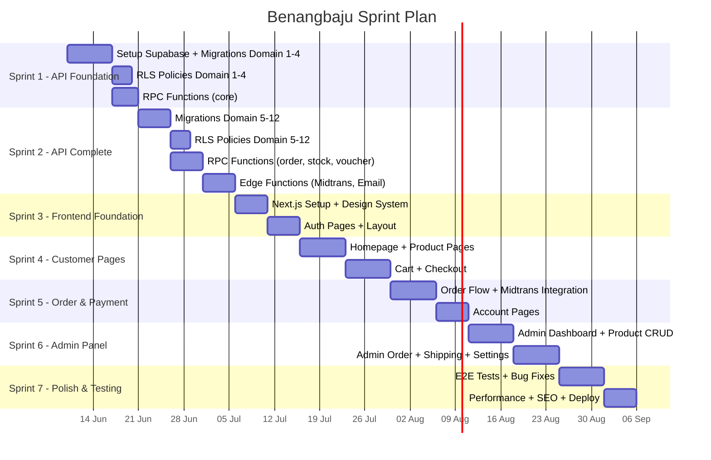

# 🏃 Sprint Plan — Benangbaju E-Commerce

> **Referensi:** [benangbaju_prd.md](file:///d:/Aulia%20Project/benangbaju_prd.md)
> **Strategi:** API-First → Frontend menyusul
> **Sprint Duration:** 1–2 minggu per sprint

---

## Overview

---

## Sprint 1 — API Foundation (Minggu 1–2)

> **Fokus:** Setup Supabase, database schema domain inti, RLS, dan RPC functions dasar.

### 1.1 Setup Supabase Project
- [x] Buat project Supabase (atau init lokal dengan `supabase init`)
- [x] Konfigurasi `supabase/config.toml`
- [ ] Setup Supabase Auth (email+password, Google OAuth) — *requires Supabase Dashboard*
- [ ] Buat storage buckets — *requires Supabase Dashboard atau `supabase start`*

### 1.2 Database Migrations — Domain 1 (User & Auth)
- [x] Migration: `profiles` table + trigger `handle_new_user`
- [x] Migration: `user_addresses` table
- [x] RLS policies untuk `profiles` dan `user_addresses`
- [ ] Test: registrasi → auto-create profile — *requires `supabase start` (Docker)*

### 1.3 Database Migrations — Domain 2 (Katalog & Produk)
- [x] Migration: `categories` (self-referencing)
- [x] Migration: `collections` + `collection_products`
- [x] Migration: `products` (termasuk `search_vector` generated column)
- [x] Migration: `product_variants` + `product_variant_attrs`
- [x] Migration: `product_images`
- [x] Migration: `product_marketplace_links`
- [x] RLS policies: public read, admin write
- [x] Indexes: slug, category_id, search_vector (GIN)

### 1.4 Database Migrations — Domain 3 (Inventori)
- [x] Migration: `stock_mutations`
- [x] RLS: admin only

### 1.5 Database Migrations — Domain 4 (Cart & Wishlist)
- [x] Migration: `carts` + `cart_items`
- [x] Migration: `wishlist_items`
- [x] RLS: user_id atau session_id based

### 1.6 RPC Functions — Core
- [x] `calculate_shipping(zone_id, weight_gram)` → return shipping options
- [x] `validate_voucher(code, subtotal, user_id)` → return discount
- [x] `adjust_stock(variant_id, qty, note, admin_id)` → admin manual adjustment
- [x] Helper trigger: `update_updated_at` (reusable)
- [x] Helper trigger: `reset_default_address`
- [x] Helper function: `is_admin()` (reusable)

### 1.7 Seed Data
- [x] Seed: sample categories (5 parent + 5 sub-categories)
- [x] Seed: sample collections (3: New Arrivals, Best Seller, Edisi Lebaran)
- [x] Seed: sample products (3) + variants (16) + attrs + images + marketplace links
- [x] Seed: collection_products links
- [ ] Seed: admin user profile — *requires auth.users via Supabase Dashboard*
- [ ] Seed: shipping zones + rates + districts — *Sprint 2 tables*
- [ ] Seed: site_settings default values — *Sprint 2 tables*

### ✅ Sprint 1 — Definition of Done
- [x] Semua tabel domain 1–4 terbuat (migration files ready)
- [x] RLS policy terdefinisi untuk semua tabel
- [x] Seed data tersedia untuk development frontend
- [ ] `supabase db reset` berjalan tanpa error — *requires Docker running*

---

## Sprint 2 — API Complete (Minggu 3–4)

### 2.1 Database Migrations — Domain 5 (Promosi)
- [x] Migration: `vouchers` + `voucher_usages`
- [x] Migration: `flash_sales` + `flash_sale_items`

### 2.2 Database Migrations — Domain 6 (Order)
- [x] Migration: `orders` + `order_items` + `order_shipping`
- [x] RLS: user baca order sendiri, admin baca semua

### 2.3 Database Migrations — Domain 7 (Payment)
- [x] Migration: `payments` + `payment_logs`

### 2.4 Database Migrations — Domain 8 (Shipping)
- [x] Migration: `shipping_zones` + `shipping_zone_coverage` + `shipping_rates` + `districts`
- [x] Seed: data kecamatan Indonesia (15 sample districts)

### 2.5 Database Migrations — Domain 9 (Review)
- [x] Migration: `product_reviews` + `review_media` + `review_replies` + `product_rating_summary`
- [x] Trigger: `recalculate_rating_summary`

### 2.6 Database Migrations — Domain 10 (Admin & CMS)
- [x] Migration: `banners` + `landing_pages` + `redirects` + `site_settings` + `admin_activity_logs`

### 2.7 Database Migrations — Domain 11 (Notifikasi)
- [x] Migration: `notification_templates` + `notifications`
- [x] Seed: 5 default notification templates

### 2.8 Database Migrations — Domain 12 (Return)
- [x] Migration: `return_requests` + `return_items` + `return_media`

### 2.9 Database Migrations — Tambahan
- [x] Migration: `stock_notifications` + trigger `notify_back_in_stock`
- [x] Migration: `search_logs`
- [x] Migration: `rate_limit_logs`

### 2.10 RPC Functions — Order & Stock
- [x] `create_order(params)` — atomic checkout transaction
- [x] `cancel_order(order_id, reason)` — cancel + restore stock
- [x] `adjust_stock(variant_id, qty, note, admin_id)` — *(Sprint 1)*
- [x] `lazy_cancel_expired_orders(user_id)` — auto-cancel >24h
- [x] `generate_order_number()` — helper

### 2.11 Edge Functions
- [x] `generate-payment` — Midtrans Snap token generation
- [x] `midtrans-webhook` — Payment callback handler (SHA-512 signature verification)
- [x] `send-email` — SMTP email sender (with template support)
- [x] `generate-invoice` — HTML invoice generation
- [x] `_shared/cors.ts` — Shared CORS headers

### 2.12 RLS Policies — Complete
- [x] Review semua tabel: public read vs auth required vs admin only
- [ ] Test cross-user access — *requires `supabase start` (Docker)*
- [ ] Test admin access — *requires `supabase start` (Docker)*

### 2.13 Seed Data Sprint 2
- [x] 5 shipping zones + 34 province coverages + 12 rates
- [x] 15 sample districts
- [x] 19 site_settings defaults
- [x] 5 notification templates
- [x] 3 sample banners
- [x] 2 sample vouchers (WELCOME10, FREEONGKIR)

### ✅ Sprint 2 — Definition of Done
- [x] Semua 38+ tabel terbuat (migration files ready)
- [x] Semua RPC functions terdefinisi
- [x] Edge Functions terbuat (4 functions)
- [x] Full RLS coverage untuk semua tabel
- [x] Seed data lengkap untuk development
- [ ] `supabase db reset` berjalan tanpa error — *requires Docker*
- [ ] Midtrans webhook tested (sandbox) — *requires Supabase running*
- [ ] Email terkirim via Edge Function — *requires SMTP config*

---

## Sprint 3 — Frontend Foundation (Minggu 5–6)

### 3.1 Next.js Setup
- [x] Init Next.js 16 (App Router, TypeScript)
- [x] Install dependencies (Tailwind v4, Zustand, React Query, Framer Motion, etc.)
- [x] Setup Supabase client (browser + server)
- [x] Setup React Query provider
- [x] Generate TypeScript types dari Supabase (`supabase gen types` placeholder created)

### 3.2 Design System
- [x] Color palette, typography (Google Fonts)
- [x] Tailwind config (custom colors, fonts)
- [x] Shared components: Button, Input, Modal, Card, Badge, Skeleton, Toast
- [x] Layout: CustomerLayout (header + footer), AdminLayout (sidebar)

### 3.3 Auth Pages
- [x] `/masuk` — Login (email + Google OAuth)
- [x] `/daftar` — Register
- [x] `/lupa-password` — Forgot password
- [x] `/reset-password` — Reset password
- [x] Auth middleware (protect routes)
- [x] Zustand authStore + onAuthStateChange

---

## Sprint 4 — Customer Pages (Minggu 7–8)

### 4.1 Homepage
- [x] HeroSection (banner carousel)
- [x] FlashSaleSection (countdown + products)
- [x] CategorySection
- [x] CollectionSection
- [x] FeaturedProductsSection
- [x] NewArrivalsSection
- [x] RecentlyViewedSection

### 4.2 Product Pages
- [x] `/produk` — Katalog (filter, sort, pagination, search)
- [x] `/produk/[slug]` — Detail (gallery, variants, marketplace links, reviews, related)
- [x] `/kategori/[slug]` — Per kategori
- [x] `/koleksi/[slug]` — Per koleksi
- [x] `/flash-sale` — Flash sale page
- [x] `/search` — Search results

### 4.3 Cart & Wishlist
- [x] `/cart` — Keranjang (guest + auth)
- [x] Zustand cartStore (persist + sync)
- [x] `/wishlist` — Wishlist (auth required)
- [x] Guest cart merge on login

---

## Sprint 5 — Order & Payment (Minggu 9–10)

### 5.1 Checkout
- [x] `/checkout` — Address selection, shipping calculator, voucher, payment summary
- [x] Call `create_order` RPC
- [x] Midtrans Snap.js integration

### 5.2 Order Management
- [x] `/pesanan` — Order history (filter, pagination)
- [x] `/pesanan/[orderNumber]` — Order detail (items, shipping, payment status)
- [x] Cancel order
- [x] Confirm delivery
- [x] Invoice PDF download
- [x] Lazy cancel expired orders

### 5.3 Account Pages
- [x] `/akun` — Profile (edit name, phone, avatar)
- [x] `/akun/alamat` — Address management (CRUD, set default)
- [ ] Change password
- [ ] Notifications page
- [x] Return request form

---

## Sprint 6 — Admin Panel (Minggu 11–12)

### 6.1 Admin Core
- [x] Admin layout (sidebar, topbar, breadcrumb)
- [x] Dashboard (revenue, orders, customers, low stock alerts)
- [x] Admin guard middleware

### 6.2 Admin CRUD
- [x] Products + variants + images + marketplace links
- [x] Categories (hierarchical)
- [x] Collections
- [x] Orders (list, detail, update status, input resi)
- [x] Vouchers
- [x] Flash Sales
- [x] Banners
- [x] Reviews (moderate, reply, pin)
- [x] Stock (adjustment, mutation history)
- [ ] Shipping (zones, coverage, rates)
- [ ] CMS (landing pages, redirects)
- [ ] Customers (list, activate/deactivate)
- [x] Settings (store info, SEO, social)
- [x] Return requests (approve/reject/complete)
- [x] Activity Logs

---

## Sprint 7 — Polish & Deploy (Minggu 13–14)

### 7.1 Testing
- [ ] Unit tests (Vitest): kalkulasi harga, diskon, ongkir
- [ ] Integration tests: RPC functions
- [ ] E2E tests (Playwright): happy path checkout, auth, admin
- [ ] RLS tests: cross-user access

### 7.2 Performance & SEO
- [ ] Core Web Vitals optimization (LCP ≤ 2.5s)
- [ ] Image optimization (Supabase Storage transforms)
- [ ] Dynamic sitemap + robots.txt
- [ ] Per-page metadata (title, description)
- [ ] Redirects via middleware

### 7.3 Security Review
- [ ] RLS audit
- [ ] Env vars review (no secrets in frontend)
- [ ] Rate limiting implementation
- [ ] CSRF / XSS checks

### 7.4 Deployment
- [ ] Vercel deployment setup
- [ ] Supabase production project
- [ ] Midtrans production keys
- [ ] SMTP production config
- [ ] Sentry error monitoring
- [ ] Domain & SSL

### 7.5 Static Pages
- [ ] `/tentang` — Tentang kami
- [ ] `/kontak` — Kontak (WhatsApp CTA)
- [ ] `/cara-belanja` — Panduan belanja
- [ ] `/pengiriman` — Info pengiriman & zona
- [ ] `/retur` — Kebijakan retur
- [ ] `/syarat-ketentuan` — Terms & Conditions
- [ ] `/kebijakan-privasi` — Privacy Policy

---

## Prioritas Domain per Sprint

| Sprint | Domain | Prioritas |
|--------|--------|-----------|
| **1** | User & Auth, Katalog, Inventori, Cart & Wishlist | 🔴 Kritis |
| **2** | Promosi, Order, Payment, Shipping, Review, Admin CMS, Notifikasi, Return | 🔴 Kritis |
| **3** | Frontend Foundation, Auth, Design System | 🔴 Kritis |
| **4** | Homepage, Product Pages, Cart UI | 🟡 Tinggi |
| **5** | Checkout, Order UI, Account | 🟡 Tinggi |
| **6** | Admin Panel (semua CRUD) | 🟡 Tinggi |
| **7** | Testing, Polish, SEO, Deploy | 🟢 Penting |

---

## Catatan

> [!IMPORTANT]
> Sprint 1 & 2 (API) harus selesai sebelum Sprint 3 dimulai agar frontend bisa langsung pakai data real.

> [!TIP]
> Gunakan `supabase db reset` untuk re-run semua migrations + seed saat development.
> Gunakan `supabase gen types typescript` untuk generate TypeScript types setelah schema berubah.
