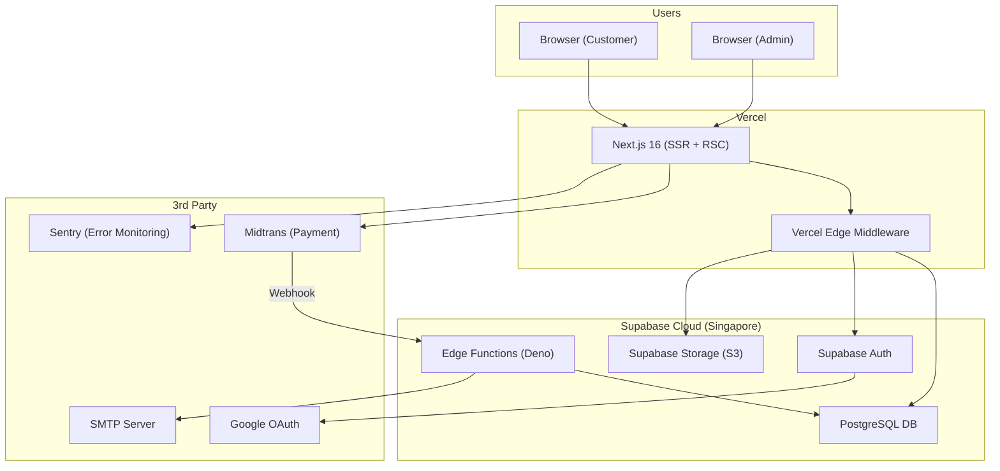

# 🚀 Deployment Guide — Benangbaju E-Commerce

> **Referensi:** [benangbaju_prd.md](file:///d:/Aulia%20Project/benangbaju_prd.md) — Bagian 2.3 & 27

---

## Daftar Isi

1. [Architecture Overview](#1-architecture-overview)
2. [Supabase Production](#2-supabase-production)
3. [Vercel Deployment](#3-vercel-deployment)
4. [Midtrans Production](#4-midtrans-production)
5. [Domain & SSL](#5-domain--ssl)
6. [Monitoring & Alerts](#6-monitoring--alerts)
7. [Checklist Pre-Launch](#7-checklist-pre-launch)

---

## 1. Architecture Overview



---

## 2. Supabase Production

### 2.1 Setup Production Project

1. Buat project baru di [supabase.com](https://supabase.com) (atau gunakan existing)
2. Region: **Southeast Asia (Singapore)** — terdekat ke Indonesia
3. Catat semua keys (URL, Anon Key, Service Role Key)

### 2.2 Push Migrations ke Production

```bash
# Link ke project production
supabase link --project-ref <project-ref>

# Push semua migrations
supabase db push

# Verify di Supabase Dashboard → SQL Editor
```

### 2.3 Deploy Edge Functions

```bash
# Deploy semua Edge Functions
supabase functions deploy midtrans-webhook
supabase functions deploy generate-payment
supabase functions deploy send-email
supabase functions deploy generate-invoice

# Set production secrets
supabase secrets set MIDTRANS_SERVER_KEY=Mid-server-xxxx    # Production key!
supabase secrets set MIDTRANS_MODE=production
supabase secrets set MIDTRANS_SNAP_API_URL=https://app.midtrans.com/snap/v1/transactions
supabase secrets set SMTP_HOST=smtp.gmail.com
supabase secrets set SMTP_PORT=587
supabase secrets set SMTP_USER=no-reply@benangbaju.com
supabase secrets set SMTP_PASS=xxxx
supabase secrets set SMTP_FROM="Benangbaju <no-reply@benangbaju.com>"
supabase secrets set SUPABASE_URL=https://xxxx.supabase.co
supabase secrets set SUPABASE_SERVICE_ROLE_KEY=eyJ...
supabase secrets set APP_URL=https://benangbaju.com
supabase secrets set ADMIN_EMAIL=admin@benangbaju.com
supabase secrets set ADMIN_WHATSAPP=628xxxxxxxxxx
```

### 2.4 Setup Storage Buckets (Production)

Buat buckets yang sama seperti di development (lihat [06_environment_setup.md](file:///d:/Aulia%20Project/docs/06_environment_setup.md#24-setup-storage-buckets)).

### 2.5 Seed Production Data

```bash
# Seed minimal: admin user, categories, shipping zones, site settings
# JANGAN seed sample products ke production
psql <production-connection-string> -f supabase/seed-production.sql
```

---

## 3. Vercel Deployment

### 3.1 Connect Repository

1. Buka [vercel.com](https://vercel.com) → Import Git Repository
2. Pilih repository Benangbaju
3. Framework Preset: **Next.js**
4. Root Directory: `./` (atau sesuaikan)

### 3.2 Environment Variables di Vercel

Di Vercel Dashboard → Settings → Environment Variables:

| Variable | Value | Environment |
|----------|-------|-------------|
| `NEXT_PUBLIC_SUPABASE_URL` | `https://xxxx.supabase.co` | Production |
| `NEXT_PUBLIC_SUPABASE_ANON_KEY` | `eyJ...` | Production |
| `NEXT_PUBLIC_MIDTRANS_CLIENT_KEY` | `Mid-client-xxxx` | Production |
| `NEXT_PUBLIC_MIDTRANS_SNAP_URL` | `https://app.midtrans.com/snap/snap.js` | Production |
| `NEXT_PUBLIC_APP_URL` | `https://benangbaju.com` | Production |
| `NEXT_PUBLIC_APP_NAME` | `Benangbaju` | Production |
| `NEXT_PUBLIC_SENTRY_DSN` | `https://xxxx@sentry.io/xxxx` | Production |

### 3.3 Build Settings

```json
// vercel.json (jika perlu custom)
{
  "framework": "nextjs",
  "buildCommand": "npm run build",
  "installCommand": "npm install"
}
```

### 3.4 Deploy

```bash
# Auto-deploy on push to main branch (Vercel default)
git push origin main

# Manual deploy
npx vercel --prod
```

---

## 4. Midtrans Production

### 4.1 Aktivasi Production

1. Midtrans Dashboard → Settings → Environment → Switch to **Production**
2. Complete KYC (Know Your Customer) jika belum
3. Catat Production keys:
   - **Client Key:** `Mid-client-xxxx`
   - **Server Key:** `Mid-server-xxxx`

### 4.2 Set Notification URL (Production)

1. Midtrans Dashboard → Settings → Payment Notification URL
2. Set ke: `https://xxxx.supabase.co/functions/v1/midtrans-webhook`

### 4.3 Test Production

- Lakukan test transaction kecil dengan kartu/e-wallet asli
- Verify webhook masuk dan order status terupdate

---

## 5. Domain & SSL

### 5.1 Custom Domain

1. Beli domain `benangbaju.com` (Niagahoster, Namecheap, dll)
2. Di Vercel Dashboard → Settings → Domains → Add `benangbaju.com`
3. Set DNS records sesuai instruksi Vercel:
   - `A` record → `76.76.21.21`
   - `CNAME` → `cname.vercel-dns.com`
4. SSL otomatis oleh Vercel (Let's Encrypt)

### 5.2 Redirect

- `www.benangbaju.com` → `benangbaju.com` (redirect di Vercel)
- HTTP → HTTPS (otomatis oleh Vercel)

---

## 6. Monitoring & Alerts

### 6.1 Sentry Setup

```bash
# Install Sentry SDK
npm install @sentry/nextjs

# Init
npx @sentry/wizard@latest -i nextjs
```

```typescript
// sentry.client.config.ts
import * as Sentry from '@sentry/nextjs'

Sentry.init({
  dsn: process.env.NEXT_PUBLIC_SENTRY_DSN,
  environment: process.env.NODE_ENV,
  tracesSampleRate: 0.1,
  replaysSessionSampleRate: 0.05,
})
```

### 6.2 Alert Rules

| Condition | Severity | Channel |
|-----------|----------|---------|
| Error rate > 1% / 5 min | 🔴 Critical | Email + Slack |
| New error di `create_order` | 🔴 Critical | Immediate |
| New error di `midtrans-webhook` | 🔴 Critical | Immediate |
| P95 response > 2s | 🟡 Warning | Email |
| Unhandled rejection | 🟡 Warning | Email |

### 6.3 Vercel Analytics

- Aktifkan di Vercel Dashboard → Analytics
- Monitor: Core Web Vitals (LCP, FID, CLS)
- Target: LCP ≤ 2.5s, TTFB ≤ 800ms

### 6.4 Supabase Monitoring

- Dashboard → Reports → Database Performance
- Monitor: slow queries, connection pool, storage usage

---

## 7. Checklist Pre-Launch

### Security
- [ ] Semua RLS policies aktif dan tested
- [ ] `SUPABASE_SERVICE_ROLE_KEY` tidak ada di frontend env
- [ ] `MIDTRANS_SERVER_KEY` tidak ada di `NEXT_PUBLIC_*`
- [ ] SMTP menggunakan App Password (bukan password asli)
- [ ] Rate limiting aktif
- [ ] CORS konfigurasi benar

### Infrastructure
- [ ] Supabase production project ready
- [ ] Semua migrations pushed
- [ ] Edge Functions deployed
- [ ] Edge Function secrets set (production keys)
- [ ] Storage buckets created
- [ ] Vercel deployed + custom domain
- [ ] SSL active

### 3rd Party
- [ ] Midtrans production mode aktif
- [ ] Midtrans notification URL set ke production Edge Function
- [ ] Google OAuth redirect URI set ke production Supabase
- [ ] SMTP production configured
- [ ] Sentry production DSN configured

### Data
- [ ] Admin user created
- [ ] Categories seeded
- [ ] Shipping zones + rates seeded
- [ ] Districts data imported
- [ ] Site settings configured
- [ ] Notification templates seeded
- [ ] Default banner created

### Testing
- [ ] E2E checkout flow tested (production)
- [ ] Midtrans payment tested (real transaction)
- [ ] Email sending tested
- [ ] Mobile responsive verified
- [ ] Cross-browser tested (Chrome, Safari, Firefox)

### SEO
- [ ] Sitemap accessible (`/sitemap.xml`)
- [ ] Robots.txt configured
- [ ] Meta tags per page
- [ ] Google Search Console connected
- [ ] Google Analytics / Vercel Analytics aktif

### Monitoring
- [ ] Sentry alerts configured
- [ ] Vercel Analytics enabled
- [ ] Supabase dashboard accessible
- [ ] Error notification channel (Slack/Email) ready
