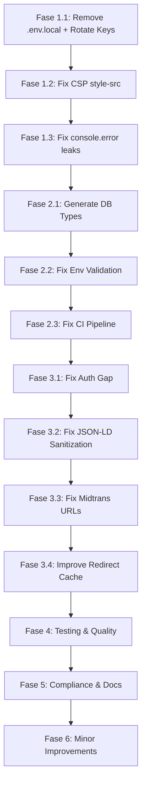

# Implementation Plan — Benangbaju Production Readiness

Rencana implementasi lengkap untuk **semua 27 temuan** dari deep scan audit. Dikelompokkan dalam 6 fase berdasarkan prioritas dan dependency.

**Total estimasi:** ~15–20 jam kerja

---

## Fase 1 — Critical Security 🔴 (Effort: ~2 jam)

### 1.1 Remove `.env.local` dari Git & Rotate Keys

> [!CAUTION]
> **INI PRIORITAS PALING TINGGI.** Semua key yang pernah ter-expose harus di-rotate, bukan hanya di-hapus.

#### [MODIFY] [.gitignore](file:///d:/Aulia%20Project/benangbaju/.gitignore)
Pastikan `.env.local` sudah ada di pattern (sudah ada: `.env*`). Tidak perlu diubah.

#### Langkah Eksekusi:
```bash
# 1. Remove .env.local from git tracking (keep the file locally)
cd benangbaju
git rm --cached .env.local

# 2. Commit the removal
git add .gitignore
git commit -m "chore: remove .env.local from tracking"

# 3. Verify it's no longer tracked
git ls-files | grep .env
```

#### Post-action: ROTATE ALL KEYS
Setelah push, semua key berikut HARUS di-rotate dari dashboard masing-masing:
- **Supabase:** Dashboard → Settings → API → Regenerate anon key & service role key
- **Midtrans:** Dashboard → Settings → Access Keys → Generate new keys
- **ERP_API_KEY:** Generate key baru, update di production env

> [!WARNING]
> Jika repo pernah public atau di-fork, pertimbangkan `git filter-branch` atau BFG Repo Cleaner untuk menghapus dari history.

---

### 1.2 Fix CSP `style-src` untuk Production

Tailwind CSS v4 dan React inline styles akan blocked oleh `style-src 'self'` tanpa `'unsafe-inline'`.

#### [MODIFY] [next.config.ts](file:///d:/Aulia%20Project/benangbaju/next.config.ts)

```diff
 value:
   `default-src 'self'; script-src 'self' ${process.env.NODE_ENV === 'development' ? "'unsafe-eval'" : ''} https://app.sandbox.midtrans.com https://app.midtrans.com; style-src 'self'; img-src 'self' data: blob: ${...} https://lh3.googleusercontent.com; connect-src 'self' https://*.supabase.co wss://*.supabase.co https://app.sandbox.midtrans.com https://app.midtrans.com; frame-src 'self' https://app.sandbox.midtrans.com https://app.midtrans.com;`
```
Ubah `style-src 'self'` menjadi:
```diff
-style-src 'self';
+style-src 'self' 'unsafe-inline';
```

**Alasan:** Tailwind v4 menggunakan `@layer` dan CSS custom properties yang di-inject inline. Tanpa `'unsafe-inline'`, style bisa tidak render di production. Nonce-based approach idealnya lebih baik, tapi Next.js 16 belum fully support per-request nonce pada CSP headers di `next.config.ts` (hanya di middleware). Untuk sekarang, `'unsafe-inline'` adalah trade-off yang acceptable untuk style — ini BUKAN script, jadi risiko XSS-nya minimal.

**Verifikasi:** Build production → buka di browser → pastikan tidak ada CSP violation di console.

---

### 1.3 Fix `console.error` leak di API routes

#### [MODIFY] [orders/route.ts](file:///d:/Aulia%20Project/benangbaju/src/app/api/v1/orders/route.ts)
```diff
-    console.error('Create Order API error:', err)
+    safeLogError('Create Order API error:', err)
```
Tambahkan import: `import { safeLogError } from '@/lib/logger'`

#### [MODIFY] [inventory/sync/route.ts](file:///d:/Aulia%20Project/benangbaju/src/app/api/v1/inventory/sync/route.ts)
```diff
-    console.error('Inventory Sync API error:', err)
+    safeLogError('Inventory Sync API error:', err)
```
Tambahkan import: `import { safeLogError } from '@/lib/logger'`

#### [MODIFY] [products/route.ts](file:///d:/Aulia%20Project/benangbaju/src/app/api/v1/products/route.ts)
```diff
-    console.error('Products API error:', err)
+    safeLogError('Products API error:', err)
```
Tambahkan import: `import { safeLogError } from '@/lib/logger'`

**Alasan:** `console.error` di production bisa leaking stack traces dan detail internal. `safeLogError` sudah di-setup untuk structured JSON logging tanpa PII.

---

## Fase 2 — Critical Infrastructure 🔴 (Effort: ~1.5 jam)

### 2.1 Generate Proper Database Types

#### Langkah Eksekusi:
```bash
# Jalankan supabase locally dulu (atau connect ke remote)
cd benangbaju
npm run db:types
```

Ini akan mengganti isi [database.ts](file:///d:/Aulia%20Project/benangbaju/src/shared/types/database.ts) dari:
```typescript
export type Database = any
```
Menjadi proper generated types dengan semua tabel, kolom, dan tipe data.

> [!IMPORTANT]
> Setelah generate, kemungkinan besar akan ada TypeScript errors di seluruh codebase karena banyak `any` yang sekarang menjadi typed. Ini harus di-fix satu per satu, tapi itu justru **keuntungannya** — setiap bug yang tersembunyi oleh `any` akan terungkap.

**Verifikasi:** `npx tsc --noEmit` — fix any type errors yang muncul.

---

### 2.2 Fix Env Validation — Tambahkan `NEXT_PUBLIC_BASE_URL`

#### [MODIFY] [env.ts](file:///d:/Aulia%20Project/benangbaju/src/lib/env.ts)

```diff
 const requiredEnvVars = [
   'NEXT_PUBLIC_SUPABASE_URL',
   'NEXT_PUBLIC_SUPABASE_ANON_KEY',
   'NEXT_PUBLIC_MIDTRANS_CLIENT_KEY',
   'NEXT_PUBLIC_MIDTRANS_SNAP_URL',
   'NEXT_PUBLIC_APP_URL',
+  'NEXT_PUBLIC_BASE_URL',
 ] as const
```

#### [MODIFY] [.env.example](file:///d:/Aulia%20Project/benangbaju/.env.example)
Sudah ada `NEXT_PUBLIC_BASE_URL=http://localhost:3000` — ✅

#### [MODIFY] `.env.local` (local only, not committed)
Tambahkan:
```
NEXT_PUBLIC_BASE_URL=http://localhost:3000
```
Dan di production env:
```
NEXT_PUBLIC_BASE_URL=https://www.benangbaju.com
```

---

### 2.3 Fix CI Pipeline — Tambahkan Env, Test, dan Type Check

#### [MODIFY] [ci.yml](file:///d:/Aulia%20Project/.github/workflows/ci.yml)

```yaml
name: CI

on:
  push:
    branches: [ "main" ]
  pull_request:
    branches: [ "main" ]

jobs:
  build-and-lint:
    runs-on: ubuntu-latest

    env:
      NEXT_PUBLIC_SUPABASE_URL: http://127.0.0.1:54321
      NEXT_PUBLIC_SUPABASE_ANON_KEY: dummy-anon-key-for-ci
      NEXT_PUBLIC_MIDTRANS_CLIENT_KEY: Mid-client-dummy
      NEXT_PUBLIC_MIDTRANS_SNAP_URL: https://app.sandbox.midtrans.com/snap/snap.js
      NEXT_PUBLIC_APP_URL: http://localhost:3000
      NEXT_PUBLIC_BASE_URL: http://localhost:3000
      MIDTRANS_SERVER_KEY: dummy-server-key-for-ci
      SUPABASE_SERVICE_ROLE_KEY: dummy-service-role-key-for-ci
      ERP_API_KEY: dummy-erp-key-for-ci

    steps:
    - uses: actions/checkout@v4
    
    - name: Use Node.js
      uses: actions/setup-node@v4
      with:
        node-version: '20'
        cache: 'npm'
        cache-dependency-path: 'benangbaju/package-lock.json'
        
    - name: Install dependencies
      working-directory: ./benangbaju
      run: npm ci

    - name: Lint
      working-directory: ./benangbaju
      run: npm run lint

    - name: Test
      working-directory: ./benangbaju
      run: npm run test

    - name: Build
      working-directory: ./benangbaju
      run: npm run build
```

**Perubahan:**
1. ✅ Tambah `env` block dengan dummy values untuk semua required env vars
2. ✅ Tambah step `Test` (menjalankan `npm run test`)
3. Test dijalankan sebelum build supaya feedback lebih cepat

---

## Fase 3 — Important Bug Fixes 🟠 (Effort: ~1.5 jam)

### 3.1 Fix `getOrderDetailAction` Auth Gap

`getOrderDetailAction` bisa dipanggil tanpa `userId`, yang berarti tanpa auth check. Dari analisis caller ([useOrders.ts](file:///d:/Aulia%20Project/benangbaju/src/modules/orders/hooks/useOrders.ts) L28), hook `useOrderDetail` memang menerima userId optional — tapi admin punya `adminGetOrdersAction` sendiri, jadi path tanpa userId ini tidak diperlukan.

#### [MODIFY] [actions.ts](file:///d:/Aulia%20Project/benangbaju/src/modules/orders/actions.ts)

```diff
-export async function getOrderDetailAction(orderNumber: string, userId?: string) {
-  if (userId) {
-    const { user } = await requireAuth()
-    if (user.id !== userId) throw new Error('Unauthorized')
-  }
-  return orderService.getOrderDetail(orderNumber, userId)
+export async function getOrderDetailAction(orderNumber: string, userId?: string) {
+  const { user } = await requireAuth()
+  // If userId is provided, verify ownership. Otherwise use the authenticated user's ID.
+  const effectiveUserId = userId || user.id
+  if (user.id !== effectiveUserId) throw new Error('Unauthorized')
+  return orderService.getOrderDetail(orderNumber, effectiveUserId)
 }
```

**Efek:** Semua panggilan ke `getOrderDetailAction` sekarang **selalu** memerlukan authentication. Jika caller tidak menyertakan userId, akan otomatis menggunakan user yang sedang login. Admin tetap menggunakan `adminGetOrdersAction` terpisah yang sudah dilindungi `requireAdmin()`.

---

### 3.2 Fix Homepage JSON-LD Sanitization

Product page sudah sanitize JSON-LD dengan `.replace(/</, '\\u003c')`, tapi homepage tidak.

#### [MODIFY] [page.tsx](file:///d:/Aulia%20Project/benangbaju/src/app/(customer)/page.tsx)

Tambahkan helper function dan sanitize kedua JSON-LD blocks:
```diff
+  const sanitizeJsonLd = (obj: Record<string, unknown>) =>
+    JSON.stringify(obj).replace(/</g, '\\u003c').replace(/>/g, '\\u003e')
+
   return (
     <>
       <script
         type="application/ld+json"
-        dangerouslySetInnerHTML={{ __html: JSON.stringify(organizationJsonLd) }}
+        dangerouslySetInnerHTML={{ __html: sanitizeJsonLd(organizationJsonLd) }}
       />
       <script
         type="application/ld+json"
-        dangerouslySetInnerHTML={{ __html: JSON.stringify(websiteJsonLd) }}
+        dangerouslySetInnerHTML={{ __html: sanitizeJsonLd(websiteJsonLd) }}
       />
```

---

### 3.3 Fix Midtrans Sandbox URL → Environment-Aware

#### [MODIFY] [generate-payment/index.ts](file:///d:/Aulia%20Project/supabase/functions/generate-payment/index.ts)

```diff
+    const midtransSnapBaseUrl = midtransMode === "production"
+      ? "https://app.midtrans.com/snap/v2/vtweb"
+      : "https://app.sandbox.midtrans.com/snap/v2/vtweb";
+
     // ... inside the token reuse block:
-            redirectUrl = responseObj.redirect_url || `https://app.sandbox.midtrans.com/snap/v2/vtweb/${snapToken}`;
+            redirectUrl = responseObj.redirect_url || `${midtransSnapBaseUrl}/${snapToken}`;
```

**Catatan:** Variable `midtransMode` sudah dibaca dari env (L155: `Deno.env.get("MIDTRANS_MODE")`), tapi hanya digunakan untuk info. Sekarang juga digunakan untuk URL.

Perlu pindahkan deklarasi `midtransMode` ke atas, sebelum block token reuse (sebelum L112).

---

### 3.4 Improve Redirect Cache Safety

#### [MODIFY] [middleware.ts](file:///d:/Aulia%20Project/benangbaju/src/lib/supabase/middleware.ts)

```diff
-// Cache for database-driven redirects
-const redirectCache = new Map<string, { to_path: string; status_code: number; expiresAt: number }>()
-const CACHE_TTL = 60 * 1000 // 1 minute
-const NEGATIVE_CACHE_TTL = 10 * 1000 // 10 seconds
+// Cache for database-driven redirects
+// Max size prevents unbounded memory growth in long-lived server processes
+const MAX_CACHE_SIZE = 500
+const redirectCache = new Map<string, { to_path: string; status_code: number; expiresAt: number }>()
+const CACHE_TTL = 60 * 1000 // 1 minute
+const NEGATIVE_CACHE_TTL = 10 * 1000 // 10 seconds
```

Dan di cleanup section (L64-73):
```diff
-      if (redirectCache.size > 1000) {
+      if (redirectCache.size > MAX_CACHE_SIZE) {
         const now = Date.now()
         for (const [key, val] of redirectCache.entries()) {
           if (val.expiresAt < now) {
             redirectCache.delete(key)
           }
         }
-        if (redirectCache.size > 1000) {
+        if (redirectCache.size > MAX_CACHE_SIZE) {
           redirectCache.clear()
         }
       }
```

**Alasan:** Menurunkan threshold dari 1000 → 500 mengurangi memory footprint. Constant-nya juga sekarang configurable.

---

## Fase 4 — Testing & Quality 🟠 (Effort: ~5 jam)

### 4.1 Tambah Test untuk Checkout Flow

#### [NEW] `src/modules/orders/__tests__/createSecureOrderAction.test.ts`

Test cases yang perlu di-cover:
1. ✅ User tidak authorized → return UNAUTHORIZED
2. ✅ Checkout lock sudah ada → return CHECKOUT_IN_PROGRESS
3. ✅ Address invalid / missing zone → return INVALID_ADDRESS
4. ✅ Cart kosong → return EMPTY_CART
5. ✅ Cart berubah antara validasi → return CART_CHANGED
6. ✅ Shipping rate tidak valid → return INVALID_SHIPPING
7. ✅ Happy path → create order successfully
8. ✅ Lock selalu di-release di finally block

```typescript
// Skeleton — test akan menggunakan mock Supabase client
import { describe, it, expect, vi, beforeEach } from 'vitest'

// Mock dependencies
vi.mock('@/lib/auth-guard')
vi.mock('@/modules/orders/order.service')
vi.mock('@/modules/shipping/shipping.service')

describe('createSecureOrderAction', () => {
  it('should reject if user.id !== params.userId', async () => { /* ... */ })
  it('should return CHECKOUT_IN_PROGRESS if lock already exists', async () => { /* ... */ })
  it('should return EMPTY_CART if no items in cart', async () => { /* ... */ })
  it('should return CART_CHANGED if cart changes during checkout', async () => { /* ... */ })
  it('should release lock in finally block even on error', async () => { /* ... */ })
  it('should override shipping cost with server-calculated rate', async () => { /* ... */ })
})
```

### 4.2 Tambah Test untuk Auth Guard

#### [NEW] `src/lib/__tests__/auth-guard.test.ts`

```typescript
import { describe, it, expect, vi } from 'vitest'

vi.mock('@/lib/supabase/server')

describe('requireAuth', () => {
  it('should throw UnauthorizedError if no user session', async () => { /* ... */ })
  it('should return user and supabase if authenticated', async () => { /* ... */ })
})

describe('requireAdmin', () => {
  it('should throw UnauthorizedError if no user session', async () => { /* ... */ })
  it('should throw ForbiddenError if user is not admin', async () => { /* ... */ })
  it('should return user, supabase, profile if admin', async () => { /* ... */ })
})
```

### 4.3 Tambah PR Template

#### [NEW] `.github/PULL_REQUEST_TEMPLATE.md`

```markdown
## Deskripsi
<!-- Jelaskan KENAPA perubahan ini dibuat, bukan hanya APA yang diubah -->

## Jenis Perubahan
- [ ] Bug fix
- [ ] Fitur baru
- [ ] Refactor
- [ ] Dokumentasi
- [ ] Chore / maintenance

## Checklist
- [ ] Self-review code sudah dilakukan
- [ ] Test baru ditambahkan / test lama diupdate
- [ ] Tidak ada `console.log` tertinggal
- [ ] Tidak ada credential/secret yang ter-hardcode
- [ ] Build berhasil tanpa error (`npm run build`)

## Screenshots (jika ada perubahan UI)
<!-- Tambahkan screenshot before/after -->
```

### 4.4 Accessibility Audit

Ini memerlukan **running app** dan tidak bisa fully automated. Langkah:

1. `npm run build && npm run start`
2. Buka Chrome DevTools → Lighthouse → Run Accessibility audit
3. Fix issues yang ditemukan (biasanya: missing alt text, contrast ratio, label associations)
4. Test keyboard navigation pada flow kritikal: login → browse → add to cart → checkout

**Output:** Lighthouse score ≥ 90 untuk accessibility.

---

## Fase 5 — Compliance & Documentation 🟠 (Effort: ~4 jam)

### 5.1 Update Kebijakan Privasi — UU PDP Compliance

Halaman kebijakan privasi yang ada ([kebijakan-privasi/page.tsx](file:///d:/Aulia%20Project/benangbaju/src/app/(customer)/kebijakan-privasi/page.tsx)) sudah memiliki 6 section. Perlu ditambahkan section berikut untuk comply dengan **UU No. 27 Tahun 2022 tentang Pelindungan Data Pribadi**:

#### [MODIFY] [kebijakan-privasi/page.tsx](file:///d:/Aulia%20Project/benangbaju/src/app/(customer)/kebijakan-privasi/page.tsx)

Tambahkan sections berikut ke array `sections`:

```typescript
{
  title: '7. Dasar Pemrosesan Data',
  content:
    'Sesuai dengan UU No. 27 Tahun 2022 tentang Pelindungan Data Pribadi (UU PDP), kami memproses data pribadi Anda berdasarkan persetujuan yang Anda berikan saat mendaftar akun dan/atau melakukan pemesanan, serta untuk pelaksanaan perjanjian jual beli antara Anda dan Benangbaju.',
},
{
  title: '8. Retensi Data',
  content:
    'Data transaksi Anda disimpan selama diperlukan untuk memenuhi kewajiban hukum kami (termasuk perpajakan dan pelaporan keuangan), minimal 5 tahun sejak transaksi terakhir. Data akun yang tidak aktif selama lebih dari 2 tahun akan dihapus secara otomatis kecuali terdapat kewajiban hukum untuk menyimpannya lebih lama.',
},
{
  title: '9. Hak Subjek Data Pribadi',
  content:
    'Sebagaimana diatur dalam UU PDP, Anda memiliki hak untuk: (a) mengakses dan mendapatkan salinan data pribadi Anda; (b) memperbarui atau memperbaiki ketidakakuratan data; (c) mengakhiri pemrosesan dan menghapus data pribadi Anda; (d) menarik kembali persetujuan pemrosesan data; (e) mengajukan keberatan atas pemrosesan data; (f) mendapatkan dan memindahkan data pribadi Anda. Untuk menggunakan hak-hak tersebut, silakan hubungi kami melalui cs@benangbaju.com.',
},
{
  title: '10. Transfer Data',
  content:
    'Data Anda diproses dan disimpan di server yang dikelola oleh Supabase (Singapore region). Pembayaran diproses oleh Midtrans (PT Midtrans Indonesia). Kedua penyedia layanan ini memiliki standar keamanan data yang memadai sesuai regulasi yang berlaku.',
},
```

Juga update tanggal:
```diff
-Terakhir diperbarui: 10 Juni 2026
+Terakhir diperbarui: 13 Juli 2026
```

---

### 5.2 Buat Rollback Strategy Documentation

#### [NEW] `benangbaju/docs/ROLLBACK.md`

```markdown
# Rollback Strategy

## Application Rollback
Benangbaju di-deploy via Vercel. Untuk rollback:
1. Buka Vercel Dashboard → Deployments
2. Temukan deployment terakhir yang stabil
3. Klik "..." → Promote to Production

## Database Rollback
Supabase migrations bersifat forward-only. Untuk rollback:

### Critical migrations yang perlu manual rollback:
| Migration | Rollback SQL |
|-----------|-------------|
| `20260713000000_checkout_locks.sql` | `DROP TABLE IF EXISTS public.checkout_locks;` |
| `20260713000001_monetary_bigint.sql` | ALTER columns back to float4 (WARNING: potential data loss) |
| `20260713000003_atomic_rate_limit.sql` | `DROP FUNCTION IF EXISTS public.check_rate_limit;` |
| `20260713000005_return_requests_rls.sql` | `DROP POLICY IF EXISTS "..." ON public.return_requests;` |

### Rollback Procedure:
1. **Stop traffic** ke production (maintenance mode)
2. **Backup database** via Supabase Dashboard → Database → Backups
3. **Run rollback SQL** di Supabase SQL Editor
4. **Verify** schema dan data integrity
5. **Deploy** versi kode yang sesuai
6. **Re-enable traffic**

### RTO / RPO
- **RTO (Recovery Time Objective):** 30 menit (Vercel rollback) / 1 jam (database rollback)
- **RPO (Recovery Point Objective):** 24 jam (Supabase automatic daily backup)
```

---

## Fase 6 — Minor Improvements 🟡 (Effort: ~4 jam)

### 6.1 Health Check Endpoint

#### [NEW] `src/app/api/health/route.ts`

```typescript
import { NextResponse } from 'next/server'
import { createServerClient } from '@/lib/supabase/server'

export async function GET() {
  const checks: Record<string, 'ok' | 'error'> = {}

  try {
    const supabase = await createServerClient()
    const { error } = await supabase.from('categories').select('id').limit(1)
    checks.database = error ? 'error' : 'ok'
  } catch {
    checks.database = 'error'
  }

  const allOk = Object.values(checks).every((v) => v === 'ok')

  return NextResponse.json(
    {
      status: allOk ? 'healthy' : 'degraded',
      timestamp: new Date().toISOString(),
      checks,
    },
    { status: allOk ? 200 : 503 }
  )
}
```

---

### 6.2 Optimasi Rate Limit Cleanup

Saat ini, setiap call ke `check_rate_limit` menjalankan `DELETE FROM rate_limit_logs WHERE created_at < window_start`. Pada traffic tinggi, ini bisa jadi bottleneck.

#### [NEW] `supabase/migrations/YYYYMMDD_rate_limit_cron_cleanup.sql`

```sql
-- Buat scheduled job untuk cleanup rate limit logs setiap 5 menit
-- Memerlukan pg_cron extension (sudah tersedia di Supabase)
SELECT cron.schedule(
  'cleanup-rate-limit-logs',
  '*/5 * * * *',
  $$DELETE FROM public.rate_limit_logs WHERE created_at < (now() - interval '2 minutes')$$
);
```

#### [MODIFY] `supabase/migrations/20260713000003_atomic_rate_limit.sql` (hanya pada deploy baru)

Hapus inline cleanup di function:
```diff
 BEGIN
   v_window_start := (now() - (p_window_sec || ' seconds')::interval);
 
-  -- Delete old logs outside the window to keep table small
-  DELETE FROM public.rate_limit_logs WHERE created_at < v_window_start;
-
   -- Count and insert
```

> [!NOTE]
> Jika menggunakan Supabase hosted, `pg_cron` harus di-enable dari Dashboard → Database → Extensions.

---

### 6.3 Circuit Breaker untuk External Services

#### [NEW] `src/lib/utils/circuit-breaker.ts`

```typescript
type CircuitState = 'closed' | 'open' | 'half-open'

export class CircuitBreaker {
  private state: CircuitState = 'closed'
  private failures = 0
  private lastFailureTime = 0

  constructor(
    private readonly threshold: number = 5,
    private readonly resetTimeoutMs: number = 30_000
  ) {}

  async execute<T>(operation: () => Promise<T>): Promise<T> {
    if (this.state === 'open') {
      if (Date.now() - this.lastFailureTime > this.resetTimeoutMs) {
        this.state = 'half-open'
      } else {
        throw new Error('Circuit breaker is open — service temporarily unavailable')
      }
    }

    try {
      const result = await operation()
      this.onSuccess()
      return result
    } catch (error) {
      this.onFailure()
      throw error
    }
  }

  private onSuccess() {
    this.failures = 0
    this.state = 'closed'
  }

  private onFailure() {
    this.failures++
    this.lastFailureTime = Date.now()
    if (this.failures >= this.threshold) {
      this.state = 'open'
    }
  }
}
```

**Usage** (future — tidak wajib sekarang):
```typescript
const midtransCircuit = new CircuitBreaker(3, 60_000)
await midtransCircuit.execute(() => invokeWithRetry(...))
```

---

### 6.4 License Audit

#### Langkah Eksekusi:
```bash
cd benangbaju
npm run audit:licenses
```

Periksa output untuk lisensi copyleft:
- ❌ **GPL, AGPL, LGPL** — tidak kompatibel dengan closed-source commercial
- ✅ **MIT, Apache-2.0, ISC, BSD** — aman

Jika ada dependency dengan lisensi copyleft, cari alternatif atau pastikan penggunaannya sesuai terms.

---

### 6.5 PR Template (sudah di Fase 4.3)

Sudah tercakup di atas.

---

## Verification Plan

### Automated Tests
```bash
cd benangbaju
npm run test            # All unit tests
npm run lint            # ESLint
npm run build           # Production build (catches type errors)
npx tsc --noEmit        # Explicit type check (optional, build covers it)
```

### Manual Verification
1. **CSP Testing:** Build → start → buka di browser → check Console for CSP violations
2. **Auth Testing:** Coba akses `/admin`, `/akun`, `/checkout` tanpa login → harus redirect
3. **Payment Flow:** Test dengan Midtrans sandbox → verify webhook idempotency
4. **Accessibility:** Run Lighthouse audit → target score ≥ 90
5. **Env Validation:** Hapus satu env variable → verify app throws error di startup

### CI Verification
Push ke branch → verify GitHub Actions:
- ✅ Lint passes
- ✅ Tests pass
- ✅ Build succeeds with dummy env vars

---

## Urutan Eksekusi yang Direkomendasikan



> [!IMPORTANT]
> **Fase 1 dan 2 HARUS selesai sebelum go-live.** Fase 3-4 sangat disarankan. Fase 5-6 bisa dilakukan incremental setelah launch.

Approve untuk mulai eksekusi?
